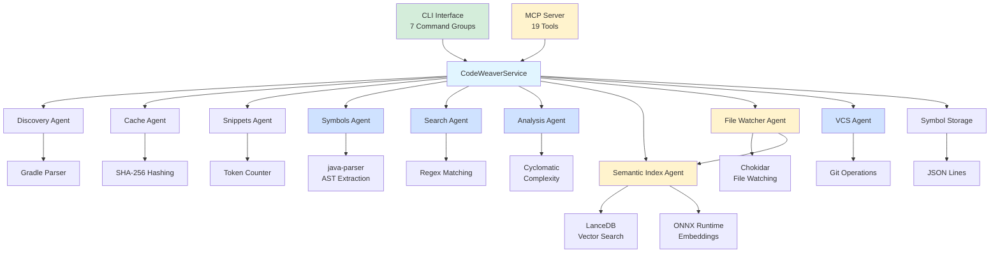

# CodeWeaver 🕸️

> ⚠️ **Beta Release (v0.2.0)** - Major Java support update! Complete modern Java support (Java 8-23) with comprehensive symbol extraction. Feedback welcome!

**Token-efficient MCP server for Java 21 LTS/Gradle project analysis**

Weaving Java Code Intelligence for LLMs - A lightweight Model Context Protocol server that provides token-efficient access to Java/Gradle codebases through a multi-agent architecture.

## ⚡ Highlights

- ✅ **Zero Native Dependencies*** - Pure Node.js/TypeScript with java-parser
- ✅ **Dual Interface** - CLI tool AND MCP server from same codebase
- ✅ **Token-Efficient** - Smart file reading with token limits
- ✅ **Complete Java 21 LTS Support** 🆕 - Modern Java features (Records, Sealed Classes, Module System)
  - 🎯 **100% Production Coverage** - All features for Java 8-23 🆕
  - ✅ **Class-Level Annotations** - Spring, JPA, Jakarta EE fully supported 🆕
  - ✅ **Method Parameters** - Names, types, and annotations extracted 🆕
  - ✅ **Generic Type Parameters** - Full signature with bounds 🆕
  - ✅ **Sealed Classes** - Java 17+ sealed/non-sealed support 🆕
  - ✅ **Records** - Java 14+ with components and methods 🆕
  - ✅ **Module System** - module-info.java parsing 🆕
- ✅ **Powerful Search** - Keyword, pattern, AND semantic search (AI-powered) 🆕
- ✅ **Semantic Code Search** - Find code by meaning/intent using LanceDB + Transformers 🆕
  - ⚡ **ONNX Runtime Optimizations** - Multi-threading + SIMD for 3x faster embeddings! 🆕
  - ⚡ **16x faster with Batch-Processing** - 10k files in ~10 min (was 8h!)
  - 🎯 **Multi-Collection Support** - Separate indexes for Code AND Docs! 🆕
  - 🔍 **File Watcher** - Automatic incremental updates on file changes! 🆕
  - 📖 **[SEMANTIC_SEARCH.md](./SEMANTIC_SEARCH.md)** - Comprehensive guide with workflows and best practices
  - 🎯 **[MULTI_COLLECTION_GUIDE.md](./MULTI_COLLECTION_GUIDE.md)** - Multi-collection usage guide (Code + Docs)
  - 🔍 **[FILE_WATCHER_GUIDE.md](./FILE_WATCHER_GUIDE.md)** - Keep your index always up-to-date!
  - 🚀 **[PERFORMANCE_OPTIMIZATION.md](./PERFORMANCE_OPTIMIZATION.md)** - Future optimizations (GPU acceleration)
- ✅ **Code Quality Analysis** - Cyclomatic complexity, LOC metrics, import analysis
- ✅ **Git Integration** - Status, diff, blame, log, branches, compare
- ✅ **Test-Driven** - 102 tests passing (15 new Java tests) 🆕

> **\*** Core features (Discovery, Symbols, Search, Analysis, VCS) have zero native dependencies. Semantic Search optionally requires LanceDB + ONNX Runtime (native components).

---

## 🚀 Quick Start

```bash
# Install
npm install

# Build
npm run build

# Use as CLI
npm run dev -- info
npm run dev -- symbols index
npm run dev -- search keyword "CodeWeaver"
npm run dev -- analysis project

# Use as MCP Server
npm run dev -- --mcp
```

### 📖 New to CodeWeaver?

**👉 [DEVELOPER_WORKFLOW.md](./DEVELOPER_WORKFLOW.md)** - Complete end-to-end guide showing all 19 MCP tools in action!

Learn by example:
- Real-world scenario (User Management Microservice)
- 6 development phases from onboarding to deployment
- Typical Claude Code conversations
- Best practices and power user tips

---

## 📦 Current Features (Phase 1 + 2 + 3 + 4 Complete)

### ✅ Implemented

**Agents:**
- **Discovery Agent** - Gradle project metadata extraction (version, dependencies, plugins)
- **Cache Agent** - Content-addressable caching with SHA-256 hashing
- **Snippets Agent** - Token-efficient file reading with line ranges
- **Symbols Agent** - Complete Java symbol extraction 🆕
  - Classes, Interfaces, Enums, Records, Annotation Types
  - Methods with parameters, generics, and annotations
  - Fields with annotations and modifiers
  - Constructors, nested types, enum constants
  - Sealed classes, module system support
- **Search Agent** - Keyword and pattern search with file filtering
- **Analysis Agent** - Cyclomatic complexity, LOC metrics, code quality
- **VCS Agent** - Git operations (status, diff, blame, log, branches, compare)
- **Semantic Index Agent** - LanceDB vector search with multi-collection support 🆕
- **File Watcher Agent** - Automatic incremental index updates on file changes 🆕
- **Symbol Storage** - In-memory symbol index with JSON Lines persistence

**MCP Tools (19 total):**

*File & Project:*
- `project.meta` - Get project metadata (Java version, modules, dependencies)
- `file.read` - Read file with optional token limit (default: 10000)
- `file.readRange` - Read specific line ranges (1-indexed, inclusive)
- `file.readWithNumbers` - Read file with line numbers for reference

*Symbols:*
- `symbols.index` - Index entire project and extract symbols
- `symbols.find` - Find symbols by name (case-insensitive substring)
- `symbols.findByKind` - Find symbols by kind (class/method/field/constructor)
- `symbols.get` - Get symbol details by qualified name

*Search:*
- `search.keyword` - Search for keyword in files (grep-like)
- `search.files` - Find files by name pattern (glob-like: *.java)

*Analysis:*
- `analysis.file` - Analyze single file for complexity and metrics
- `analysis.project` - Analyze entire project for statistics

*Version Control:*
- `vcs.status` - Get Git repository status
- `vcs.diff` - Get diff for file(s)
- `vcs.blame` - Get Git blame information for file
- `vcs.log` - Get commit history
- `vcs.branches` - Get list of all branches
- `vcs.compare` - Compare two branches

**CLI Commands:**

*Info & Files:*
- `codeweaver info` - Display project information
- `codeweaver file read <path> [--limit N] [--numbers]` - Read files
- `codeweaver file range <path> <start> <end>` - Read line ranges
- `codeweaver file context <path> <line> [-c N]` - Get context around line

*Symbols:*
- `codeweaver symbols index` - Index project and extract symbols
- `codeweaver symbols find <name>` - Find symbols by name
- `codeweaver symbols get <qualifiedName>` - Get symbol details
- `codeweaver symbols list <kind>` - List all symbols of a kind

*Search:*
- `codeweaver search keyword <keyword> [-i] [-m N] [-c N] [-e .ext]` - Keyword search
- `codeweaver search files <pattern>` - Find files by pattern
- `codeweaver search semantic <query> [--index] [-c collection] [-l N]` - Semantic search 🆕

*Analysis:*
- `codeweaver analysis file <path>` - Analyze file complexity and metrics
- `codeweaver analysis project [--top N]` - Analyze project statistics
- `codeweaver analysis complexity <path>` - Show complexity breakdown

*Version Control:*
- `codeweaver vcs status` - Show Git repository status
- `codeweaver vcs diff [file]` - Show diff for file(s)
- `codeweaver vcs blame <file> [-l <range>]` - Show Git blame
- `codeweaver vcs log [-n N] [--since] [--author]` - Show commit history
- `codeweaver vcs branches` - List all branches
- `codeweaver vcs compare <base> <compare>` - Compare two branches

*File Watching:* 🆕
- `codeweaver watch [--debounce N] [--code-only] [--docs-only]` - Watch files and auto-update index

**Infrastructure:**
- Auto-detection (stdio = MCP mode, TTY = CLI mode)
- Progress tracking (JSON Lines format to `.codeweaver/progress.jsonl`)
- Checkpoint/resume capability
- TypeScript strict mode, ESM modules
- Vitest test framework (73 tests passing)

---

## 🏗️ Architecture

### Multi-Agent System



### Directory Structure

```
src/
├── index.ts                      # Main entry (auto-detection)
├── cli/
│   ├── index.ts                  # CLI entry point
│   └── commands/
│       ├── info.ts               # Info command
│       ├── file.ts               # File commands
│       ├── symbols.ts            # Symbols commands (Phase 2)
│       ├── search.ts             # Search commands (Phase 2)
│       └── analysis.ts           # Analysis commands (Phase 3)
├── mcp/
│   ├── index.ts                  # MCP entry point
│   ├── server.ts                 # MCPServer class
│   └── tools.ts                  # Tool registration (12 tools)
├── core/
│   ├── service.ts                # Shared business logic
│   ├── agents/
│   │   ├── discovery.ts          # Gradle analysis
│   │   ├── cache.ts              # Caching
│   │   ├── snippets.ts           # File reading
│   │   ├── symbols.ts            # Java symbol extraction (Phase 2)
│   │   ├── search.ts             # Keyword/pattern search (Phase 2)
│   │   └── analysis.ts           # Complexity analysis (Phase 3)
│   └── storage/
│       └── json-symbol-store.ts  # Symbol index
├── types/
│   ├── mcp.ts
│   ├── progress.ts
│   ├── project.ts
│   ├── cache.ts
│   ├── symbols.ts
│   └── analysis.ts               # Analysis types (Phase 3)
└── utils/
    ├── progress-writer.ts        # Progress tracking
    └── mode-detector.ts          # CLI vs MCP detection

tests/
├── unit/                         # 57 passing tests
│   ├── mcp/server.test.ts        # 6 tests
│   ├── agents/
│   │   ├── discovery.test.ts     # 4 tests
│   │   ├── cache.test.ts         # 5 tests
│   │   ├── snippets.test.ts      # 7 tests
│   │   ├── symbols.test.ts       # 8 tests (Phase 2)
│   │   ├── search.test.ts        # 11 tests (Phase 2)
│   │   └── analysis.test.ts      # 11 tests (Phase 3)
│   └── storage/
│       └── json-symbol-store.test.ts  # 5 tests
├── integration/                  # 5 passing tests
│   └── smoke.test.ts
└── fixtures/
    └── gradle-projects/simple/   # Test fixtures
```

---

## 📖 Usage

### As CLI Tool

**Project & Files:**
```bash
# Show project information
codeweaver info

# Read entire file
codeweaver file read src/core/service.ts

# Read file with line numbers
codeweaver file read src/core/service.ts --numbers

# Read file with token limit
codeweaver file read src/core/service.ts --limit 500

# Read specific lines (1-indexed, inclusive)
codeweaver file range src/core/service.ts 10 20

# Get context around line (default: ±5 lines)
codeweaver file context src/core/service.ts 42
codeweaver file context src/core/service.ts 42 --context 10
```

**Symbols (Phase 2):**
```bash
# Index entire project
codeweaver symbols index

# Find symbols by name (case-insensitive)
codeweaver symbols find "UserService"
codeweaver symbols find "get"  # Finds all getXxx methods

# Get specific symbol by qualified name
codeweaver symbols get "com.example.UserService"
codeweaver symbols get "com.example.UserService#findById"

# List all symbols of a kind
codeweaver symbols list class
codeweaver symbols list method
codeweaver symbols list field
```

**Search (Phase 2):**
```bash
# Search for keyword
codeweaver search keyword "TODO"
codeweaver search keyword "processData"

# Case-insensitive search
codeweaver search keyword "exception" --case-insensitive
codeweaver search keyword "exception" -i

# Search with context lines
codeweaver search keyword "TODO" --context 3 -c 3

# Limit results
codeweaver search keyword "public" --max-results 10 -m 10

# Filter by file extensions
codeweaver search keyword "interface" --extensions .java .ts -e .java -e .ts

# Find files by pattern
codeweaver search files "*.java"
codeweaver search files "*Test.java"
codeweaver search files "User*.ts"
```

### As MCP Server

#### 1. Configure MCP Client

Add to your MCP configuration (e.g., Claude Desktop):

```json
{
  "mcpServers": {
    "codeweaver": {
      "command": "node",
      "args": [
        "/absolute/path/to/mcp-workbench/dist/index.js",
        "--mcp"
      ],
      "cwd": "/path/to/your/java/project"
    }
  }
}
```

Or use npm:

```json
{
  "mcpServers": {
    "codeweaver": {
      "command": "npm",
      "args": ["run", "dev", "--", "--mcp"],
      "cwd": "/absolute/path/to/mcp-workbench"
    }
  }
}
```

#### 2. Available MCP Tools (10 total)

**Project & Files:**

**`project.meta`** - Get project metadata
```typescript
// Input: {} (no parameters)
// Output: ProjectMetadata
{
  "name": "my-project",
  "version": "1.0.0",
  "javaVersion": "21",
  "gradleVersion": "8.5",
  "modules": [...],
  "dependencies": [...],
  "plugins": [...]
}
```

**`file.read`** - Read file with token limit
```typescript
// Input: { filePath: string, maxTokens?: number }
await mcp.call('file.read', {
  filePath: 'src/main/java/com/example/App.java',
  maxTokens: 5000
});
```

**`file.readRange`** - Read specific lines
```typescript
// Input: { filePath: string, startLine: number, endLine: number }
await mcp.call('file.readRange', {
  filePath: 'src/main/java/com/example/App.java',
  startLine: 10,
  endLine: 30
});
```

**`file.readWithNumbers`** - Read with line numbers
```typescript
// Input: { filePath: string }
await mcp.call('file.readWithNumbers', {
  filePath: 'src/main/java/com/example/App.java'
});
// Output: "  1: package com.example;\n  2: \n  3: public class App { ... }"
```

**Symbols (Phase 2):**

**`symbols.index`** - Index entire project
```typescript
// Input: {} (no parameters)
await mcp.call('symbols.index', {});
// Output: { files: 15, symbols: 234, classes: 12, classList: [...] }
```

**`symbols.find`** - Find symbols by name
```typescript
// Input: { name: string }
await mcp.call('symbols.find', {
  name: 'UserService'
});
// Output: SymbolDefinition[]
```

**`symbols.findByKind`** - Find symbols by kind
```typescript
// Input: { kind: 'class' | 'method' | 'field' | 'constructor' }
await mcp.call('symbols.findByKind', {
  kind: 'method'
});
// Output: SymbolDefinition[]
```

**`symbols.get`** - Get symbol by qualified name
```typescript
// Input: { qualifiedName: string }
await mcp.call('symbols.get', {
  qualifiedName: 'com.example.UserService#findById'
});
// Output: SymbolDefinition
```

**Search (Phase 2):**

**`search.keyword`** - Search for keyword in files
```typescript
// Input: { keyword: string, caseSensitive?: boolean, maxResults?: number, contextLines?: number, fileExtensions?: string[] }
await mcp.call('search.keyword', {
  keyword: 'TODO',
  caseSensitive: false,
  maxResults: 50,
  contextLines: 2,
  fileExtensions: ['.java', '.ts']
});
// Output: SearchResult[] with file, line, column, content, beforeContext, afterContext
```

**`search.files`** - Find files by pattern
```typescript
// Input: { pattern: string }
await mcp.call('search.files', {
  pattern: '*Test.java'
});
// Output: string[] (file paths)
```

---

## 🧪 Testing

```bash
# Run all tests
npm test

# Run tests in CI mode (no watch)
npm test -- --run

# Run specific test file
npm test -- tests/unit/agents/snippets.test.ts
```

**Test Coverage:**
- ✅ MCP Server (6 tests)
- ✅ Discovery Agent (4 tests)
- ✅ Cache Agent (5 tests)
- ✅ Snippets Agent (7 tests)
- ✅ Symbol Storage (5 tests)
- ✅ Symbols Agent (8 tests) - Phase 2
- ✅ Search Agent (11 tests) - Phase 2
- ✅ Analysis Agent (11 tests) - Phase 3
- ✅ Integration Tests (5 tests)
- **Total: 62/62 passing (57 unit + 5 integration)**

---

## 🔧 Development

### Prerequisites

- **Node.js** >= 20.0.0
- **TypeScript** 5.7+
- **Java** JDK 21 (for target projects)
- **Gradle** (optional, wrapper preferred)

### Setup

```bash
# Clone repository
git clone <repository-url>
cd mcp-workbench

# Install dependencies
npm install

# Build
npm run build

# Development mode (with auto-reload)
npm run build:watch

# Run in dev mode (no build required)
npm run dev
```

### Scripts

```bash
npm run build           # Compile TypeScript
npm run build:watch     # Watch mode
npm run dev             # Run with tsx (no build)
npm test                # Run tests (watch mode)
npm run lint            # ESLint
npm run format          # Prettier
npm run clean           # Remove dist & cache
```

---

## 📊 Token Efficiency

CodeWeaver is designed to minimize token usage when providing code context to LLMs:

### Strategies

1. **Line Ranges**: Only send requested line ranges, not entire files
2. **Token Limits**: Automatic truncation to configurable limits (default: 10k)
3. **Smart Truncation**: Respects word boundaries when truncating
4. **Token Counting**: Simple heuristic (~4 chars/token) for quick estimates
5. **Context Windows**: Provide minimal context around specific lines

### Token Estimation

| Content Type | Typical Size | Tokens (approx) |
|--------------|--------------|-----------------|
| Small snippet (20 lines) | ~1 KB | ~250 |
| Medium snippet (80 lines) | ~4 KB | ~1000 |
| Large snippet (200 lines) | ~10 KB | ~2500 |
| Project metadata | ~2 KB | ~500 |

**Max Response Size**: 10,000 tokens (~40 KB text)

---

## 🗺️ Roadmap

### ✅ Phase 1: Foundation (Complete - 100%)

- ✅ MCP Server skeleton with tool registration
- ✅ Progress tracking (JSON Lines)
- ✅ Discovery Agent (Gradle metadata)
- ✅ Cache Agent (content-addressable storage)
- ✅ Symbol Storage (JSON Lines persistence)
- ✅ Core Service (shared logic)
- ✅ CLI Interface with commands
- ✅ MCP Interface with stdio
- ✅ Build & Test Setup (32 tests passing)
- ✅ Snippets Agent with token limits
- ✅ Documentation (complete)
- ✅ Integration Tests (5 smoke tests)

### ✅ Phase 2: Indexing (Complete - 100%)

- ✅ Symbols Agent (java-parser, symbol extraction)
- ✅ Search Agent (keyword + pattern search)
- ✅ Project-wide indexing (classes, methods, fields, constructors)
- ✅ Symbol search (by name, kind, qualified name)
- ✅ File search (glob patterns with * and ?)
- ✅ Context search (lines before/after matches)
- ✅ MCP Tools integration (6 new tools)
- ✅ CLI Commands integration (symbols, search)
- ✅ Full test coverage (19 new tests)
- ✅ Documentation update

**Note:** LanceDB semantic search deferred to later phase as enhancement

### ✅ Phase 3: Analysis (Complete - 100%)

- ✅ Analysis Agent (complexity & metrics calculation)
- ✅ Cyclomatic Complexity calculation (if, loops, catch, &&, ||, ?:)
- ✅ Code Metrics (LOC, SLOC, comments, blank lines)
- ✅ Import analysis
- ✅ Method call detection
- ✅ Project-wide statistics (total complexity, average, top N files)
- ✅ MCP Tools integration (2 new tools)
- ✅ CLI Commands integration (analysis)
- ✅ Full test coverage (11 new tests)
- ✅ Documentation update

**Note:** Static analysis tools (SpotBugs, Checkstyle) and Gradle runner deferred

### ✅ Phase 4: VCS Integration (Complete - 100%)

- ✅ VCS Agent (Git operations)
- ✅ Repository status (modified, added, deleted, untracked files)
- ✅ Diff generation (file-level and project-level)
- ✅ Blame information (line-by-line authorship)
- ✅ Commit history (with filtering options)
- ✅ Branch management (list, compare)
- ✅ MCP Tools integration (6 new tools)
- ✅ CLI Commands integration (vcs)
- ✅ Full test coverage (11 new tests)
- ✅ Documentation update

### 📋 Phase 5: Orchestration (Planned)

- Orchestrator Agent (DAG-based pipeline)
- Parallel task execution
- Dependency resolution

---

## 🐛 Troubleshooting

### Tests failing?

```bash
# Clean and reinstall
npm run clean
rm -rf node_modules package-lock.json
npm install
npm test -- --run
```

### Build errors?

```bash
# Check TypeScript version
npx tsc --version  # Should be 5.7+

# Rebuild
npm run clean
npm run build
```

### MCP server not responding?

```bash
# Check if running in MCP mode
npm run dev -- --mcp

# Verify stdio transport
echo '{}' | npm run dev -- --mcp
```

### CLI not working?

```bash
# Ensure TTY mode (not piped)
npm run dev -- info

# Check built binary
node dist/index.js info
```

---

## 📝 Progress Tracking

View live progress during implementation:

```bash
# Bash/Git Bash
tail -f .codeweaver/progress.jsonl

# PowerShell
Get-Content .codeweaver\progress.jsonl -Wait

# Read checkpoint
cat .codeweaver/checkpoint.json
```

---

## 🤝 Contributing

Contributions welcome! Please:

1. Fork the repository
2. Create a feature branch
3. Write tests for new features
4. Ensure all tests pass: `npm test -- --run`
5. Follow code style (ESLint + Prettier)
6. Submit a pull request

### Code Style

- **TypeScript Strict Mode**: All type errors must be resolved
- **ESM Modules**: Use `.js` extensions in imports
- **Test-Driven Development**: Write tests first
- **No Unused Variables**: Clean code, no warnings

---

## 📄 License

MIT License - see [LICENSE](./LICENSE)

---

## 📚 Documentation

**Vollständige Dokumentation in [`docs/`](./docs/)**

### 🗺️ Schnellzugriff

- **[DEVELOPER_WORKFLOW.md](./DEVELOPER_WORKFLOW.md)** - 🚀 **START HERE!** Complete Developer Workflow (All 19 MCP tools in action)
- **[SEMANTIC_SEARCH.md](./SEMANTIC_SEARCH.md)** - 🔥 **NEU!** Semantic Search Guide mit Workflows, Best Practices & Integration
- **[MULTI_COLLECTION_GUIDE.md](./MULTI_COLLECTION_GUIDE.md)** - 🎯 **NEU!** Multi-Collection Guide (Code + Docs indexieren & suchen)
- **[FILE_WATCHER_GUIDE.md](./FILE_WATCHER_GUIDE.md)** - 🔍 **NEU!** File Watcher Guide (Automatische Incremental Updates)
- **[PERFORMANCE_OPTIMIZATION.md](./PERFORMANCE_OPTIMIZATION.md)** - 🚀 **NEU!** Performance Roadmap (GPU Acceleration)
- **[docs/README.md](./docs/README.md)** - Dokumentations-Index
- **[docs/ARCHITECTURE.md](./docs/ARCHITECTURE.md)** - System-Architektur (Dual-Mode, Multi-Agent)
- **[docs/USAGE.md](./docs/USAGE.md)** - CLI & MCP Usage Guide
- **[docs/STATUS_AND_ROADMAP.md](./docs/STATUS_AND_ROADMAP.md)** - Feature-Status und Roadmap
- **[docs/TESTING.md](./docs/TESTING.md)** - Test-Strategie
- **[docs/DATA_MODELS.md](./docs/DATA_MODELS.md)** - Datenstrukturen
- **[docs/TOKEN_MANAGEMENT.md](./docs/TOKEN_MANAGEMENT.md)** - Token-Effizienz

### 🔗 Externe Links

- [Model Context Protocol](https://modelcontextprotocol.io/) - MCP Specification

---

## 🎯 Current Status

**Alpha Release v0.1.0** ⚠️

✅ **Working Features:**
- **MCP Server** with 19 tools (project, files, symbols, search, analysis, vcs)
- **CLI** with 7 command groups (includes watch mode)
- **Semantic Search** with ONNX Runtime optimizations
- **Multi-Collection Support** (Code + Docs)
- **File Watcher** for automatic index updates
- **Java Symbol Extraction** - Classes, methods, fields, constructors
- **Code Quality Analysis** - Cyclomatic complexity, LOC metrics
- **Git Integration** - Status, diff, blame, log, branches
- **87 tests passing**

⚠️ **Known Limitations:**
- Performance varies on large codebases (>10k files)
- Semantic search memory usage can be high
- File watcher may miss rapid changes
- Documentation is incomplete
- Breaking changes expected in future releases

🔮 **Planned Improvements:**
- GPU acceleration for semantic search
- Better error messages
- More language support beyond Java
- Performance optimizations
- Comprehensive documentation

---

## 💡 Philosophy

**CodeWeaver** follows these principles:

1. **Token Efficiency First** - Never overwhelm LLMs with entire files
2. **Zero Native Dependencies** - Pure Node.js for portability
3. **Test-Driven Development** - Tests before implementation
4. **Dual Interface** - Same codebase serves CLI and MCP
5. **Progressive Enhancement** - Working foundation, build up from there

---

Built with ❤️ for the LLM-assisted development workflow.
