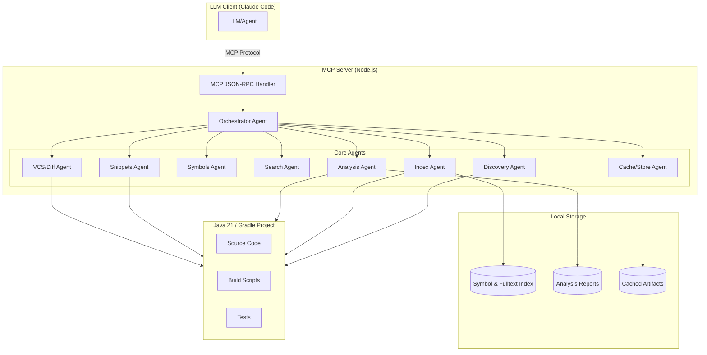
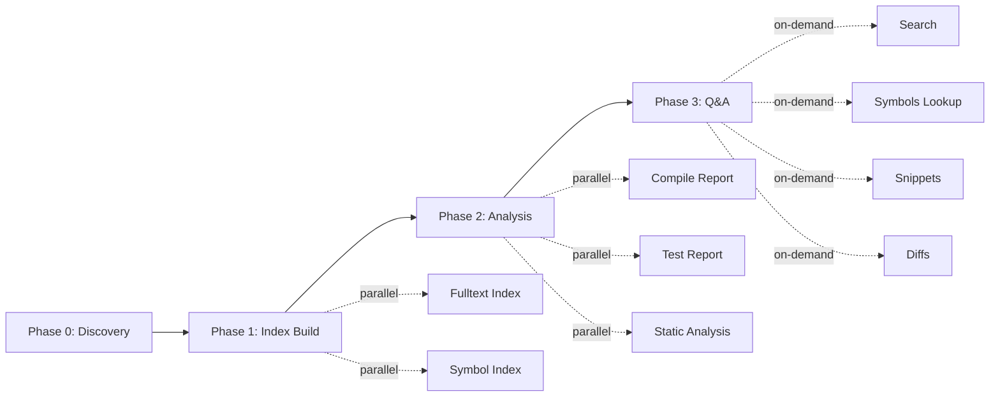
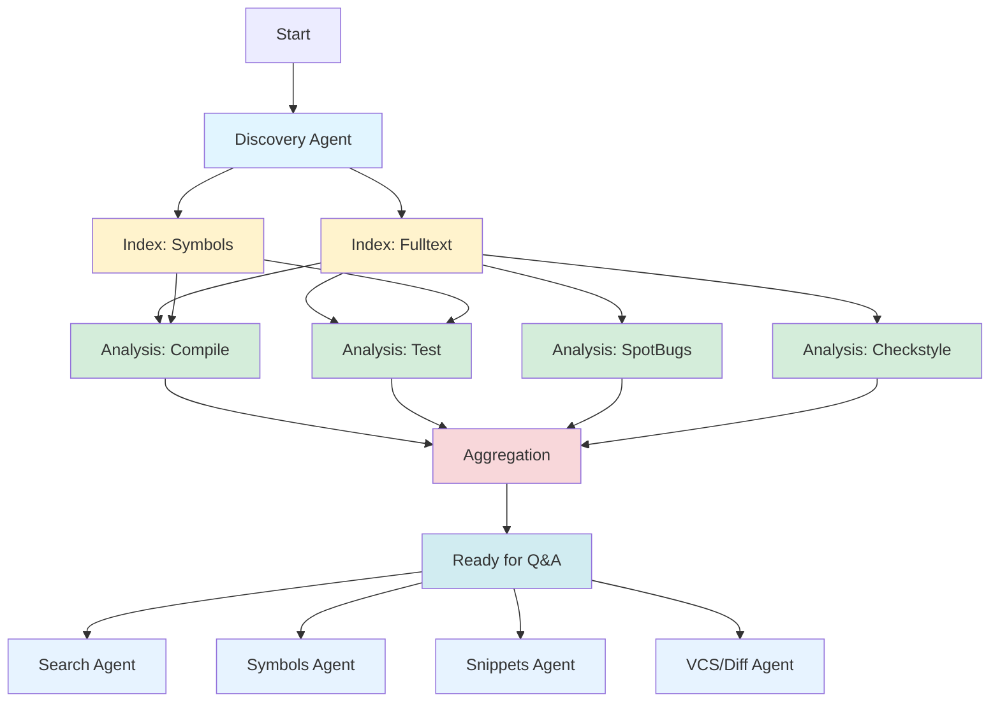
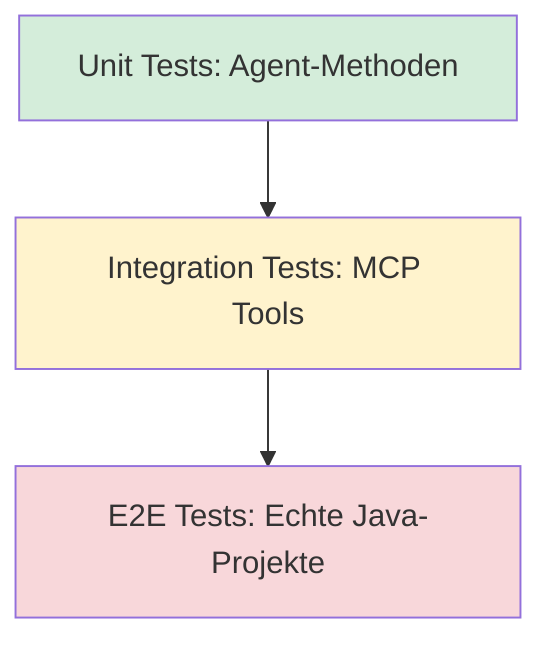
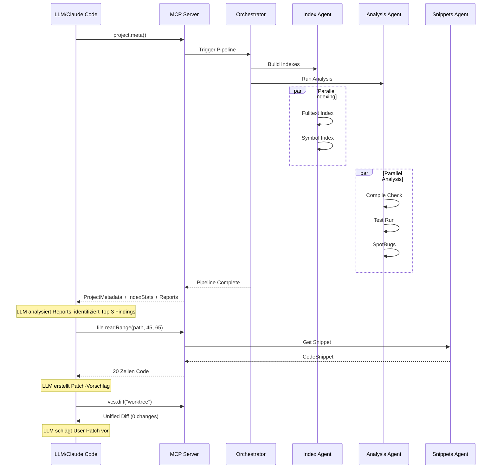

# Java Analysis MCP Server - Architektur-Konzept

## Executive Summary

Ein **lokaler MCP-Server** (Model Context Protocol) für tokenarme, indexbasierte Analyse und Refactoring von Java-21/Gradle-Projekten. Das System nutzt ein **Multi-Agenten-Architektur** mit paralleler Task-Ausführung über einen DAG (Directed Acyclic Graph) und stellt strukturierte APIs bereit, die niemals komplette Dateien, sondern nur gezielte Ausschnitte, Indizes und Reports liefern.

### Kernziele
- ⚡ **Token-Effizienz**: Niemals Volltexte, nur indexierte Treffer, Snippets (≤80 Zeilen), Reports
- 🔄 **Parallelisierung**: Multi-Agenten-System mit DAG-basierter Orchestrierung
- 🎯 **Präzision**: Symbol-/Referenzauflösung, statische Analyse, gezielte Codeausschnitte
- 💾 **Inkrementalität**: Lokales Caching, Content-Hashing, Wiederverwendung von Indizes
- 🏗️ **Erweiterbarkeit**: Modulare Agenten, plugbare Analyzer, konfigurierbare Pipelines

---

## 1. System-Überblick



### Datenfluss-Prinzipien

1. **Nie komplette Dateien**: Alle Operationen arbeiten mit:
   - Indexierten Metadaten (Symbole, Referenzen, Strukturen)
   - Gezielten Ausschnitten (≤80 Zeilen, präferiert ≤40)
   - Strukturierten Reports (Findings, Errors, Warnings)
   - Unified Diffs (nur relevante Hunks)

2. **Index-First**: Alle Anfragen nutzen zunächst Indizes, nur bei Bedarf werden Codeausschnitte geladen

3. **Lazy Loading**: Snippets und Diffs nur auf explizite Anfrage

4. **Content-Addressable Caching**: Alle Artefakte (Indizes, Reports, Snippets) werden über Content-Hashes versioniert

---

## 2. Multi-Agenten-Architektur

### 2.1 Orchestrator Agent

**Verantwortlichkeit**: Zentrale Steuerung, DAG-Planung, parallele Task-Ausführung, Ergebnis-Aggregation

#### Kernfunktionen
- **DAG-Planung**: Analysiert Abhängigkeiten zwischen Tasks und erstellt Ausführungsplan
- **Parallele Ausführung**: Startet unabhängige Tasks gleichzeitig
- **Token-Policy-Enforcement**: Überwacht und limitiert Datenmengen pro Response
- **Deduplication**: Fasst redundante Findings zusammen
- **Error Handling & Resume**: Speichert Zwischenstände, ermöglicht Wiederaufnahme

#### DAG-Phasen



#### Schnittstelle
```typescript
interface OrchestratorAPI {
  // Plant und führt komplette Analyse-Pipeline aus
  executeAnalysisPipeline(config: PipelineConfig): Promise<PipelineResult>;

  // Führt einzelne Tasks parallel aus
  executeParallelTasks(tasks: Task[]): Promise<TaskResult[]>;

  // Speichert/lädt Pipeline-Zustand für Resume
  savePipelineState(state: PipelineState): Promise<void>;
  resumePipeline(stateId: string): Promise<PipelineResult>;
}
```

---

### 2.2 Discovery Agent

**Verantwortlichkeit**: Projekt-Struktur-Erkennung, Metadaten-Sammlung

#### Aufgaben
- Erkennung von Gradle-Projekten (settings.gradle, build.gradle)
- Identifikation von Modulen und Subprojekten
- Java-Version-Erkennung (toolchain, sourceCompatibility)
- Quell-/Test-/Resource-Verzeichnisse
- Build-Skript-Analyse (Tasks, Dependencies, Plugins)

#### Output-Format
```typescript
interface ProjectMetadata {
  root: string;                    // Absolute path to project root
  modules: ModuleInfo[];           // All detected modules
  javaVersion: string;             // e.g., "21"
  gradleVersion: string;
  gradleWrapperPresent: boolean;
  sourceSets: {
    main: string[];
    test: string[];
  };
  dependencies: DependencyInfo[];
  buildTasks: string[];            // Available Gradle tasks
}

interface ModuleInfo {
  name: string;
  path: string;
  type: 'root' | 'subproject';
  sourceDirs: string[];
  testDirs: string[];
  outputDirs: string[];
}
```

#### Implementierung
- Nutzt `fs` für Datei-Traversierung
- Parst Gradle-Skripte (Groovy/Kotlin DSL) mit AST-Parser oder Regex-Heuristik
- Cacht Metadaten (mit File-Mtime-Checks für Invalidierung)

---

### 2.3 Index Agent

**Verantwortlichkeit**: Volltext- und Symbol-Index-Erstellung, inkrementelles Update

#### Index-Typen

##### A) Fulltext-Index
- **Zweck**: Pattern-basierte Suche (Regex, Plain-Text)
- **Technologie**: `lunr.js` oder `flexsearch` (in-memory), oder `sqlite3` FTS5 (persistent)
- **Inhalt**: Datei-Pfad, Zeile, Spalte, Text, Tokenized Content

##### B) Symbol-Index
- **Zweck**: Schnelle Lookup von Definitionen, Referenzen, Signaturen
- **Technologie**: Eigenes JSON/SQLite-Schema oder `tree-sitter` (Java-Parser)
- **Inhalt**:
  - Packages, Imports
  - Classes, Interfaces, Enums, Records
  - Methods, Constructors, Fields
  - Annotations
  - Referenzen (Call-Sites, Field-Access, Type-Usage)

#### Symbol-Index-Schema
```typescript
interface SymbolIndex {
  symbols: Map<SymbolId, SymbolDefinition>;
  references: Map<SymbolId, Reference[]>;
  files: Map<FilePath, FileSymbols>;
}

interface SymbolDefinition {
  id: SymbolId;              // e.g., "com.example.MyClass#myMethod"
  kind: SymbolKind;          // class | interface | method | field | ...
  name: string;
  qualifiedName: string;
  signature?: string;        // Method signatures
  location: Location;        // file, line, column
  modifiers: string[];       // public, static, final, ...
  parent?: SymbolId;         // Enclosing class/interface
  javadoc?: string;          // First 200 chars
}

interface Reference {
  from: Location;
  to: SymbolId;
  kind: 'call' | 'field-access' | 'type-usage' | 'extends' | 'implements';
}

type SymbolKind =
  | 'package' | 'import'
  | 'class' | 'interface' | 'enum' | 'record' | 'annotation'
  | 'method' | 'constructor' | 'field' | 'parameter' | 'local-variable';
```

#### Inkrementelles Update
- Content-Hashing: Nur geänderte Dateien neu indexieren
- Timestamp-Check: Vergleich Datei-Mtime vs. Index-Timestamp
- Atomic Updates: Neue Index-Version schreiben, dann Swap

#### Schnittstelle
```typescript
interface IndexAPI {
  // Baut oder aktualisiert Indizes
  buildIndex(scope?: IndexScope): Promise<IndexStats>;

  // Gibt Index-Status zurück
  getIndexStatus(): IndexStatus;

  // Invalidiert und triggert Rebuild
  invalidateIndex(scope?: IndexScope): Promise<void>;
}

interface IndexStats {
  filesIndexed: number;
  symbolsIndexed: number;
  durationMs: number;
  lastUpdated: Date;
}

type IndexScope = 'fulltext' | 'symbols' | 'all';
```

---

### 2.4 Symbols Agent

**Verantwortlichkeit**: Symbol-Lookup, Referenz-Analyse, Signatur-Info

#### Funktionen
- **Definition Lookup**: Finde Definition eines Symbols (FQN oder Location)
- **Find References**: Alle Verwendungsstellen eines Symbols
- **Type Hierarchy**: Superklassen, Interfaces, Implementierungen
- **Call Graph**: Wer ruft diese Methode auf?
- **Signature Info**: Vollständige Signatur mit Parametertypen

#### API
```typescript
interface SymbolsAPI {
  // Finde Definition
  findDefinition(query: SymbolQuery): Promise<SymbolDefinition | null>;

  // Alle Referenzen zu einem Symbol
  findReferences(symbolId: SymbolId, options?: RefOptions): Promise<Reference[]>;

  // Type-Hierarchie
  getTypeHierarchy(symbolId: SymbolId): Promise<TypeHierarchy>;

  // Call-Graph (aufrufer/aufgerufene)
  getCallGraph(methodId: SymbolId, direction: 'callers' | 'callees'): Promise<CallGraph>;

  // Signatur-Info (wie IntelliJ Quick Doc)
  getSignatureInfo(symbolId: SymbolId): Promise<SignatureInfo>;
}

interface SymbolQuery {
  qualifiedName?: string;    // e.g., "com.example.MyClass#myMethod"
  location?: Location;       // Find symbol at file:line:col
}

interface RefOptions {
  limit?: number;            // Max references
  includeTests?: boolean;
}

interface TypeHierarchy {
  symbol: SymbolDefinition;
  superclasses: SymbolDefinition[];
  interfaces: SymbolDefinition[];
  subclasses: SymbolDefinition[];
  implementations: SymbolDefinition[];
}

interface CallGraph {
  method: SymbolDefinition;
  calls: CallEdge[];
}

interface CallEdge {
  from: Location;
  to: SymbolDefinition;
  callType: 'direct' | 'virtual' | 'interface';
}
```

---

### 2.5 Search Agent

**Verantwortlichkeit**: Pattern-basierte Code-Suche mit Kontext

#### Funktionen
- Regex-basierte Suche
- Plain-Text-Suche (case-sensitive/insensitive)
- Glob-Filterung (include/exclude Pfade)
- Kontext-Zeilen (Before/After)
- Result-Limiting & Pagination

#### API
```typescript
interface SearchAPI {
  find(query: SearchQuery): Promise<SearchResult[]>;
}

interface SearchQuery {
  pattern: string;           // Regex or plain text
  mode?: 'regex' | 'text';
  caseSensitive?: boolean;
  include?: string[];        // Glob patterns (e.g., ["src/**/*.java"])
  exclude?: string[];        // Glob patterns (e.g., ["**/test/**"])
  maxResults?: number;       // Default: 100
  contextLines?: number;     // Lines before/after (default: 3)
}

interface SearchResult {
  path: string;
  line: number;
  column: number;
  lineText: string;
  linesBefore: string[];     // Context lines before match
  linesAfter: string[];      // Context lines after match
  matchGroups?: string[];    // Regex capture groups
}
```

#### Implementierung
- Nutzt Fulltext-Index für Kandidaten-Dateien
- Streaming-Suche für große Repos (Generator/AsyncIterator)
- Parallele Durchsuchung mehrerer Dateien

---

### 2.6 Analysis Agent

**Verantwortlichkeit**: Statische Analyse, Compilation, Test-Ausführung, Report-Aggregation

#### Analyse-Typen

##### A) Compilation Report
- Führt Gradle `compileJava` / `compileTestJava` aus
- Parst Compiler-Fehler und Warnungen
- Strukturiertes Output-Format

##### B) Test Report
- Führt Gradle `test` aus (oder spezifische Test-Tasks)
- Parst Test-Ergebnisse (JUnit XML, Gradle Test Reports)
- Fehler-/Failure-Extraktion mit Stacktraces

##### C) Static Analysis
- Integration mit Tools wie:
  - **SpotBugs** (Bug-Patterns)
  - **Checkstyle** (Code-Style)
  - **PMD** (Code-Quality)
  - **SonarQube** (über SonarScanner CLI)
  - **Error Prone** (Compile-Time Checks)
- Parst XML/JSON-Reports

#### Report-Format
```typescript
interface AnalysisReport {
  source: AnalysisSource;    // 'compile' | 'test' | 'spotbugs' | 'checkstyle' | ...
  timestamp: Date;
  findings: Finding[];
  summary: ReportSummary;
}

type AnalysisSource =
  | 'compile' | 'test'
  | 'spotbugs' | 'checkstyle' | 'pmd' | 'sonarqube' | 'error-prone';

interface Finding {
  ruleId?: string;           // e.g., "NP_NULL_ON_SOME_PATH"
  severity: Severity;
  category?: string;         // e.g., "CORRECTNESS", "STYLE"
  path: string;
  line: number;
  column?: number;
  endLine?: number;
  message: string;
  shortContext?: string;     // 2-3 Zeilen um die Fundstelle
  remediation?: string;      // Fix-Hinweise
}

type Severity = 'error' | 'warning' | 'info';

interface ReportSummary {
  totalFindings: number;
  errors: number;
  warnings: number;
  infos: number;
}
```

#### API
```typescript
interface AnalysisAPI {
  // Führt Analysen aus und gibt strukturierte Reports zurück
  runAnalysis(types: AnalysisSource[]): Promise<AnalysisReport[]>;

  // Lädt gecachte Reports
  getReports(filter?: ReportFilter): Promise<AnalysisReport[]>;

  // Einzelne Analyse
  runCompileCheck(): Promise<AnalysisReport>;
  runTests(options?: TestOptions): Promise<AnalysisReport>;
  runStaticAnalysis(tool: AnalysisSource): Promise<AnalysisReport>;
}

interface TestOptions {
  testClasses?: string[];    // Specific test classes
  testMethods?: string[];
}
```

#### Implementierung
- Nutzt `child_process.spawn` für Gradle-Aufrufe
- Parst Outputs mit Regex oder XML/JSON-Parser
- Cacht Reports (mit Build-Hash als Key)

---

### 2.7 Snippets Agent

**Verantwortlichkeit**: Gezielte Codeausschnitte bereitstellen mit Token-Limits

#### Funktionen
- Liest spezifische Zeilenbereich aus Dateien
- Erzwingt harte Limits: ≤80 Zeilen (idealerweise ≤40)
- Kontext-Erweiterung (z.B. ganze Methode oder Klasse)
- Syntax-Highlighting (optional, für Rendering)

#### API
```typescript
interface SnippetsAPI {
  // Liest Ausschnitt
  readRange(request: RangeRequest): Promise<CodeSnippet>;

  // Liest ganze Methode/Klasse (mit Größen-Check)
  readSymbol(symbolId: SymbolId, options?: SymbolReadOptions): Promise<CodeSnippet>;
}

interface RangeRequest {
  path: string;
  startLine: number;
  endLine: number;
  contextLines?: number;     // Additional context before/after
}

interface SymbolReadOptions {
  maxLines?: number;         // Default: 80, max: 150
  includeJavadoc?: boolean;
}

interface CodeSnippet {
  path: string;
  startLine: number;
  endLine: number;
  lines: string[];
  language: string;          // "java"
  truncated?: boolean;       // True if exceeded maxLines
}
```

#### Implementierung
- Lazy-Loading: Nur bei expliziter Anfrage
- Token-Counter: Schätzt Token-Anzahl (approx. chars/4)
- Ablehnung bei Überschreitung: Schlägt kleineren Range vor

---

### 2.8 VCS/Diff Agent

**Verantwortlichkeit**: Git-Operationen, Diff-Erzeugung, Branch-/Commit-Info

#### Funktionen
- Worktree-Status (modified, untracked files)
- Unified Diffs (Worktree, Staged, Commit-Range)
- Commit-History-Lookup
- Branch-/Tag-Info
- Blame-Info (wer hat Zeile geändert)

#### API
```typescript
interface VCSAgent {
  // Git Status
  getStatus(): Promise<VCSStatus>;

  // Unified Diff
  getDiff(scope: DiffScope): Promise<string>;

  // Commit-History
  getCommits(options?: CommitOptions): Promise<Commit[]>;

  // Blame
  getBlame(path: string, lineRange?: [number, number]): Promise<BlameLine[]>;
}

interface VCSStatus {
  branch: string;
  modified: string[];
  staged: string[];
  untracked: string[];
  ahead: number;
  behind: number;
}

type DiffScope =
  | { type: 'worktree' }
  | { type: 'staged' }
  | { type: 'commitRange', from: string, to: string }
  | { type: 'commit', hash: string };

interface CommitOptions {
  limit?: number;
  author?: string;
  since?: Date;
  path?: string;
}

interface Commit {
  hash: string;
  author: string;
  date: Date;
  message: string;
  filesChanged: string[];
}

interface BlameLine {
  line: number;
  commit: string;
  author: string;
  date: Date;
  content: string;
}
```

#### Implementierung
- Nutzt `simple-git` oder `isomorphic-git`
- Filtert Diffs auf relevante Hunks (ignoriert Whitespace-only, etc.)

---

### 2.9 Cache/Store Agent

**Verantwortlichkeit**: Artefakt-Versionierung, Content-Hashing, Cache-Invalidierung

#### Caching-Strategie

##### Content-Addressable Storage
- Alle Artefakte (Indizes, Reports, Snippets-Metadaten) haben Content-Hash als Key
- SHA-256 über:
  - Datei-Inhalt (für Source-Files)
  - Build-Skripte (build.gradle, settings.gradle)
  - Tool-Konfiguration (checkstyle.xml, spotbugs.xml)

##### Cache-Verzeichnis-Struktur
```
.mcp-cache/
├── index/
│   ├── fulltext-<hash>.db
│   └── symbols-<hash>.json
├── reports/
│   ├── compile-<hash>.json
│   ├── test-<hash>.json
│   └── spotbugs-<hash>.json
├── snippets/
│   └── <file-hash>-<startLine>-<endLine>.txt
└── metadata.json
```

##### Invalidierung
- File-Watch: Überwacht Änderungen an Source-Files (via `chokidar`)
- Manual Invalidate: API-Endpunkt für Force-Refresh
- TTL: Optionale Time-To-Live für Reports (z.B. Test-Reports 1h)

#### API
```typescript
interface CacheAPI {
  // Speichert Artefakt
  store(key: CacheKey, data: any): Promise<void>;

  // Lädt Artefakt
  load(key: CacheKey): Promise<any | null>;

  // Invalidiert Cache-Einträge
  invalidate(pattern: string): Promise<void>;

  // Cache-Statistiken
  getStats(): CacheStats;
}

interface CacheKey {
  type: 'index' | 'report' | 'snippet' | 'vcs';
  scope?: string;           // e.g., 'fulltext', 'spotbugs'
  hash: string;
}

interface CacheStats {
  totalSize: number;        // Bytes
  entries: number;
  hitRate: number;
  lastCleanup: Date;
}
```

---

## 3. MCP-Schnittstellen-Spezifikation

### 3.1 MCP Protocol Basics

Der Server implementiert das **Model Context Protocol (MCP)** über JSON-RPC 2.0:
- Transport: stdio (Standard-Input/Output)
- Encoding: JSON Lines (newline-delimited JSON)
- Methoden: `tools/list`, `tools/call`

### 3.2 Tool-Katalog

#### Tool 1: `project.meta`
**Beschreibung**: Gibt Projekt-Metadaten zurück
**Parameter**: Keine
**Returns**: `ProjectMetadata`

```json
{
  "name": "project.meta",
  "description": "Returns metadata about the Java/Gradle project",
  "inputSchema": {
    "type": "object",
    "properties": {}
  }
}
```

#### Tool 2: `search.find`
**Beschreibung**: Sucht Code-Pattern mit Kontext
**Parameter**: `SearchQuery`
**Returns**: `SearchResult[]`

```json
{
  "name": "search.find",
  "description": "Search for code patterns with context",
  "inputSchema": {
    "type": "object",
    "properties": {
      "pattern": { "type": "string", "description": "Regex or plain text" },
      "mode": { "type": "string", "enum": ["regex", "text"], "default": "text" },
      "include": { "type": "array", "items": { "type": "string" } },
      "exclude": { "type": "array", "items": { "type": "string" } },
      "maxResults": { "type": "number", "default": 100 },
      "contextLines": { "type": "number", "default": 3 }
    },
    "required": ["pattern"]
  }
}
```

#### Tool 3: `symbols.lookup`
**Beschreibung**: Sucht Symbol-Definitionen oder Referenzen
**Parameter**: `SymbolQuery`
**Returns**: `SymbolDefinition` oder `Reference[]`

```json
{
  "name": "symbols.lookup",
  "description": "Lookup symbol definitions, references, or signatures",
  "inputSchema": {
    "type": "object",
    "properties": {
      "qualifiedName": { "type": "string" },
      "location": {
        "type": "object",
        "properties": {
          "path": { "type": "string" },
          "line": { "type": "number" },
          "column": { "type": "number" }
        }
      },
      "operation": {
        "type": "string",
        "enum": ["definition", "references", "hierarchy", "signature"],
        "default": "definition"
      },
      "limit": { "type": "number", "default": 100 }
    }
  }
}
```

#### Tool 4: `analysis.getReports`
**Beschreibung**: Gibt strukturierte Analyse-Reports zurück
**Parameter**: `{ types?: AnalysisSource[] }`
**Returns**: `AnalysisReport[]`

```json
{
  "name": "analysis.getReports",
  "description": "Get analysis reports (compile, test, static analysis)",
  "inputSchema": {
    "type": "object",
    "properties": {
      "types": {
        "type": "array",
        "items": {
          "type": "string",
          "enum": ["compile", "test", "spotbugs", "checkstyle", "pmd"]
        }
      }
    }
  }
}
```

#### Tool 5: `file.readRange`
**Beschreibung**: Liest gezielten Codeausschnitt
**Parameter**: `RangeRequest`
**Returns**: `CodeSnippet`

```json
{
  "name": "file.readRange",
  "description": "Read a specific line range from a file",
  "inputSchema": {
    "type": "object",
    "properties": {
      "path": { "type": "string" },
      "startLine": { "type": "number" },
      "endLine": { "type": "number" },
      "contextLines": { "type": "number", "default": 0 }
    },
    "required": ["path", "startLine", "endLine"]
  }
}
```

#### Tool 6: `vcs.diff`
**Beschreibung**: Erzeugt Unified Diff
**Parameter**: `DiffScope`
**Returns**: `string` (Unified Diff Format)

```json
{
  "name": "vcs.diff",
  "description": "Generate unified diff",
  "inputSchema": {
    "type": "object",
    "properties": {
      "scope": {
        "type": "string",
        "enum": ["worktree", "staged", "commit", "commitRange"]
      },
      "from": { "type": "string" },
      "to": { "type": "string" }
    },
    "required": ["scope"]
  }
}
```

#### Tool 7: `index.status` & `index.refresh`
**Beschreibung**: Index-Status abfragen oder neu bauen
**Parameter**: `{ scope?: 'fulltext' | 'symbols' | 'all' }`
**Returns**: `IndexStatus` oder `IndexStats`

```json
{
  "name": "index.status",
  "description": "Get current index status",
  "inputSchema": {
    "type": "object",
    "properties": {}
  }
}
```

```json
{
  "name": "index.refresh",
  "description": "Rebuild or update indexes",
  "inputSchema": {
    "type": "object",
    "properties": {
      "scope": { "type": "string", "enum": ["fulltext", "symbols", "all"], "default": "all" }
    }
  }
}
```

---

## 4. Token-Budget-Management

### 4.1 Policies

| Artefakt-Typ | Max. Größe | Bemerkung |
|--------------|------------|-----------|
| **Snippet** | 80 Zeilen | Idealerweise ≤40 Zeilen |
| **Search Context** | 6 Zeilen vor/nach | Bei Bedarf reduzierbar |
| **Finding Context** | 3 Zeilen | Nur bei Analyse-Reports |
| **Diff Hunks** | Nur relevante Hunks | Filterung von Whitespace-only |
| **Symbol Definitions** | Top 100 Referenzen | Pagination für mehr |
| **Reports** | Strukturiert, keine Rohdaten | Nur Findings, keine Logs |

### 4.2 Token-Estimation

```typescript
function estimateTokens(text: string): number {
  // Einfache Heuristik: ~4 Zeichen pro Token
  return Math.ceil(text.length / 4);
}

function enforceTokenLimit(snippet: CodeSnippet, maxTokens: number): CodeSnippet {
  const estimatedTokens = estimateTokens(snippet.lines.join('\n'));
  if (estimatedTokens > maxTokens) {
    const maxLines = Math.floor(maxTokens * 4 / 60); // ~60 chars/line avg
    return {
      ...snippet,
      lines: snippet.lines.slice(0, maxLines),
      truncated: true
    };
  }
  return snippet;
}
```

### 4.3 Response-Größen-Limits

- **Single Tool Call**: Max. 10.000 Tokens (~40KB Text)
- **Batch Tool Calls**: Max. 25.000 Tokens insgesamt
- **Snippets pro Request**: Max. 3 Snippets
- **Search Results**: Max. 100 Treffer (mit Kontext)

---

## 5. Parallelisierungs-Strategie

### 5.1 DAG-Ausführungsplan



### 5.2 Parallelisierungs-Regeln

#### Phase 0 (Discovery): Seriell
- Nur 1 Task: Discovery Agent
- Dauer: ~100-500ms

#### Phase 1 (Index): Parallel
- Fulltext-Index und Symbol-Index können parallel laufen
- Dauer: ~2-10s (je nach Projektgröße)

#### Phase 2 (Analysis): Maximal parallel
- Alle Analysis-Typen (Compile, Test, SpotBugs, Checkstyle, etc.) parallel ausführen
- Jeder Agent schreibt in eigenes Report-File (Race-Condition-frei)
- Dauer: ~5-60s (je nach Projekt und Tools)

#### Phase 3 (Q&A): On-Demand, hochparallel
- Alle Agents (Search, Symbols, Snippets, VCS) sind unabhängig
- Können beliebig viele parallele Anfragen bearbeiten
- Keine gegenseitigen Abhängigkeiten

### 5.3 Orchestrator-Implementierung

```typescript
class OrchestratorAgent {
  async executeAnalysisPipeline(config: PipelineConfig): Promise<PipelineResult> {
    const state = new PipelineState();

    try {
      // Phase 0: Discovery (seriell)
      state.setPhase('discovery');
      const projectMeta = await this.discoveryAgent.analyze();
      state.setResult('projectMeta', projectMeta);

      // Phase 1: Index (parallel)
      state.setPhase('indexing');
      const [fulltextIndex, symbolIndex] = await Promise.all([
        this.indexAgent.buildFulltextIndex(),
        this.indexAgent.buildSymbolIndex()
      ]);
      state.setResult('fulltextIndex', fulltextIndex);
      state.setResult('symbolIndex', symbolIndex);

      // Phase 2: Analysis (maximal parallel)
      state.setPhase('analysis');
      const analysisTypes = config.analysisTypes || ['compile', 'test', 'spotbugs'];
      const reports = await Promise.all(
        analysisTypes.map(type => this.analysisAgent.runAnalysis([type]))
      );
      state.setResult('reports', reports.flat());

      // Phase 3: Ready
      state.setPhase('ready');
      await this.cacheAgent.store({ type: 'pipeline', scope: 'state', hash: state.hash }, state);

      return {
        success: true,
        projectMeta,
        indexStats: { fulltext: fulltextIndex, symbols: symbolIndex },
        reports: reports.flat(),
        state
      };

    } catch (error) {
      state.setError(error);
      await this.cacheAgent.store({ type: 'pipeline', scope: 'state', hash: state.hash }, state);
      throw error;
    }
  }
}
```

---

## 6. Technologie-Stack

### 6.1 Core Dependencies

| Komponente | Technologie | Zweck |
|------------|-------------|-------|
| **Runtime** | Node.js 20+ | Ausführungsumgebung |
| **MCP Server** | `@modelcontextprotocol/sdk` | MCP Protocol Implementierung |
| **Java Parser** | `tree-sitter` + `tree-sitter-java` | AST-Parsing für Symbolindex |
| **Search** | `flexsearch` oder `lunr.js` | Fulltext-Index (in-memory) |
| **Persistent Storage** | `better-sqlite3` | Symbolindex, Cache-Metadaten |
| **Git Integration** | `simple-git` | VCS-Operationen |
| **XML Parsing** | `fast-xml-parser` | Gradle-Skripte, Analysis-Reports |
| **File Watching** | `chokidar` | Inkrementelles Update bei Datei-Änderungen |
| **Process Management** | Native `child_process` | Gradle-Aufrufe |
| **Hashing** | Native `crypto` | Content-Addressable Caching |

### 6.2 Optional: Java-Tooling-Integration

- **SpotBugs**: Download via Gradle Plugin oder standalone JAR
- **Checkstyle**: Gradle Plugin (`checkstyle`)
- **PMD**: Gradle Plugin (`pmd`)
- **Error Prone**: Gradle Plugin (`com.google.errorprone`)

### 6.3 Projektstruktur (Node.js)

```
java-analysis-mcp-server/
├── package.json
├── tsconfig.json
├── src/
│   ├── index.ts                # MCP Server Entry Point
│   ├── mcp/
│   │   ├── server.ts           # MCP Protocol Handler
│   │   └── tools.ts            # Tool Registrierung
│   ├── agents/
│   │   ├── orchestrator.ts
│   │   ├── discovery.ts
│   │   ├── index.ts
│   │   ├── symbols.ts
│   │   ├── search.ts
│   │   ├── analysis.ts
│   │   ├── snippets.ts
│   │   ├── vcs.ts
│   │   └── cache.ts
│   ├── index/
│   │   ├── fulltext.ts
│   │   ├── symbols-indexer.ts
│   │   └── tree-sitter-parser.ts
│   ├── analysis/
│   │   ├── gradle-runner.ts
│   │   ├── report-parser.ts
│   │   └── tools/
│   │       ├── spotbugs.ts
│   │       ├── checkstyle.ts
│   │       └── pmd.ts
│   ├── storage/
│   │   ├── cache.ts
│   │   └── db.ts
│   ├── types/
│   │   ├── project.ts
│   │   ├── symbols.ts
│   │   ├── analysis.ts
│   │   └── mcp.ts
│   └── utils/
│       ├── token-estimator.ts
│       ├── file-utils.ts
│       └── logger.ts
├── .mcp-cache/                 # Cache-Verzeichnis (gitignored)
└── README.md
```

---

## 7. Implementierungs-Roadmap

### Phase 1: Foundation (Woche 1-2)
- [x] Projekt-Setup (Node.js, TypeScript, Dependencies)
- [ ] MCP Server Skeleton (stdio-based JSON-RPC)
- [ ] Discovery Agent (Gradle-Projekt-Erkennung)
- [ ] Basic File I/O (Snippets Agent ohne Index)
- [ ] Cache Agent (Content-Hashing, Local Storage)

**Deliverable**: MCP-Server, der `project.meta` und `file.readRange` bereitstellt

### Phase 2: Indexing (Woche 3-4)
- [ ] Fulltext-Index (flexsearch oder lunr.js)
- [ ] Symbol-Index (tree-sitter Java Parser)
- [ ] Index Agent (Build, Incremental Update)
- [ ] Search Agent (Pattern-basierte Suche mit Kontext)
- [ ] Symbols Agent (Definition/Reference Lookup)

**Deliverable**: Funktionierende Suche und Symbol-Navigation

### Phase 3: Analysis (Woche 5-6)
- [ ] Gradle Runner (Compile, Test Execution)
- [ ] Report Parsing (Compiler Errors, Test Results)
- [ ] Static Analysis Integration (SpotBugs, Checkstyle)
- [ ] Analysis Agent (Aggregation, Deduplication)

**Deliverable**: Strukturierte Analysis-Reports über MCP

### Phase 4: VCS & Orchestration (Woche 7)
- [ ] VCS/Diff Agent (Git Integration)
- [ ] Orchestrator Agent (DAG-Pipeline)
- [ ] Parallele Task-Ausführung
- [ ] Error Handling & Resume

**Deliverable**: Vollständige Pipeline mit Parallelisierung

### Phase 5: Optimization & Testing (Woche 8-9)
- [ ] Token-Budget-Enforcement
- [ ] Performance-Optimierung (Caching, Streaming)
- [ ] Integration Tests (mit Test-Java-Projekten)
- [ ] Dokumentation & Beispiele

**Deliverable**: Production-Ready MCP Server

---

## 8. Testing-Strategie

### 8.1 Test-Pyramide



### 8.2 Test-Projekt-Sammlung

Erstelle mehrere Referenz-Java-Projekte mit bekannten Issues:
- **simple-java**: Single-Module, Basic-Struktur
- **multi-module**: Gradle Multi-Project
- **with-bugs**: Absichtliche Compiler-Fehler, SpotBugs-Findings
- **large-codebase**: 1000+ Dateien für Performance-Tests

### 8.3 Test-Szenarien

#### Szenario 1: Cold Start
- Projekt ohne existierende Indizes
- Erwartung: Discovery → Index → Analysis in <30s

#### Szenario 2: Incremental Update
- 1 Datei geändert
- Erwartung: Nur betroffene Datei re-indexiert, <2s

#### Szenario 3: Token-Limit-Enforcement
- Request für 200-Zeilen-Methode
- Erwartung: Truncation oder Ablehnung mit Hinweis

#### Szenario 4: Parallel Analysis
- Alle Analysis-Typen gleichzeitig
- Erwartung: Keine Race-Conditions, korrekte Reports

---

## 9. Offene Fragen & Entscheidungen

### 9.1 Index-Persistenz
- **Option A**: In-Memory (schnell, aber neu bei jedem Start)
- **Option B**: SQLite (persistent, langsamer bei Queries)
- **Empfehlung**: Hybrid – Fulltext in-memory, Symbols in SQLite

### 9.2 Gradle Daemon
- Gradle Daemon für schnellere Builds nutzen?
- **Risiko**: Daemon-State kann inkonsistent werden
- **Empfehlung**: Optional via Config, Default: ohne Daemon

### 9.3 Multi-Projektfähigkeit
- Soll der Server mehrere Projekte gleichzeitig verwalten?
- **Phase 1**: Single-Project (1 Server pro Projekt)
- **Phase 2**: Multi-Project mit Workspace-Konzept

### 9.4 Security
- Gradle-Tasks könnten beliebigen Code ausführen
- **Empfehlung**: Whitelist erlaubter Tasks (compileJava, test, check)
- Sandbox-Umgebung für Gradle-Ausführung?

---

## 10. Anhang

### 10.1 Beispiel: LLM-Arbeitsablauf



### 10.2 Beispiel: MCP Tool Call

```json
{
  "jsonrpc": "2.0",
  "id": 1,
  "method": "tools/call",
  "params": {
    "name": "search.find",
    "arguments": {
      "pattern": "NullPointerException",
      "mode": "text",
      "include": ["src/**/*.java"],
      "maxResults": 50,
      "contextLines": 3
    }
  }
}
```

**Response**:
```json
{
  "jsonrpc": "2.0",
  "id": 1,
  "result": {
    "content": [
      {
        "type": "text",
        "text": "[{\"path\":\"src/main/java/com/example/Service.java\",\"line\":142,\"column\":28,\"lineText\":\"throw new NullPointerException(\\\"userId cannot be null\\\");\",\"linesBefore\":[\"public User getUser(String userId) {\",\"  if (userId == null) {\"],\"linesAfter\":[\"  }\",\"  return userRepository.findById(userId);\"]}]"
      }
    ]
  }
}
```

---

## Zusammenfassung

Dieses Architektur-Konzept definiert einen **modularen, hochparallelen MCP-Server** für tokenarme Java-21/Gradle-Analyse. Durch:
- **Agenten-basierte Architektur** mit klaren Verantwortlichkeiten
- **Index-First-Ansatz** ohne Volltext-Übertragung
- **DAG-basierte Parallelisierung** für optimale Performance
- **Content-Addressable Caching** für Inkrementalität
- **Strikte Token-Policies** für LLM-Effizienz

...ermöglicht das System präzise, schnelle Code-Analyse und Refactoring-Workflows für große Java-Codebasen.

**Nächste Schritte**: Siehe Implementierungs-Roadmap (Abschnitt 7).
