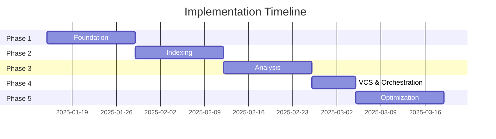
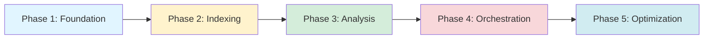

# Implementierungs-Roadmap

**Phased Implementation Plan für Java Analysis MCP Server**

---

## Übersicht

**Gesamtdauer**: ~9 Wochen (63 Tage)

---

## Phase 1: Foundation (Woche 1-2)

**Ziel**: Basis-Infrastruktur, MCP-Server, Discovery, Basic File I/O

### Task-Board

#### 1.1 Projekt-Setup ✅
- [x] Repository initialisieren
- [x] `package.json` erstellen
- [x] `tsconfig.json` konfigurieren
- [x] Dependencies installieren
- [x] `.gitignore`, `.eslintrc.json`, `.prettierrc` einrichten

**Geschätzte Dauer**: 2h

---

#### 1.2 MCP Server Skeleton
- [ ] `src/mcp/server.ts`: MCPServer-Klasse mit stdio-Handler
  - [ ] JSON-RPC 2.0 Request/Response Handling
  - [ ] `tools/list` Methode
  - [ ] `tools/call` Methode mit Tool-Routing
- [ ] `src/mcp/tools.ts`: Tool-Registrierung
  - [ ] Tool-Interface definieren
  - [ ] Tool-Registry (Map<toolName, handler>)
- [ ] `src/mcp/types.ts`: MCP-spezifische Types
  - [ ] `MCPRequest`, `MCPResponse`, `MCPError`

**Acceptance Criteria**:
- Server startet über stdio
- `tools/list` gibt leere Liste zurück
- `tools/call` gibt "Tool not found" Error bei unbekanntem Tool

**Tests**: `tests/unit/mcp/server.test.ts`

**Geschätzte Dauer**: 1 Tag

---

#### 1.3 Discovery Agent
- [ ] `src/agents/discovery.ts`: DiscoveryAgent-Klasse
  - [ ] `detectGradleProject()`: Sucht settings.gradle, build.gradle
  - [ ] `parseGradleSettings()`: Extrahiert Module (Regex/AST)
  - [ ] `parseGradleBuild()`: Extrahiert Java-Version, Plugins, Dependencies
  - [ ] `analyze()`: Kombiniert alle Infos zu `ProjectMetadata`
- [ ] `src/types/project.ts`: ProjectMetadata, ModuleInfo, etc.

**Acceptance Criteria**:
- Erkennt Single-Module & Multi-Module Gradle-Projekte
- Extrahiert Java-Version, Gradle-Version, Module, SourceSets
- Gibt strukturierte `ProjectMetadata` zurück

**Tests**:
- `tests/unit/agents/discovery.test.ts`
- Fixtures: `tests/fixtures/gradle-projects/simple/`

**Geschätzte Dauer**: 2 Tage

---

#### 1.4 Cache Agent
- [ ] `src/storage/cache.ts`: CacheStore-Klasse
  - [ ] `save(key: CacheKey, data: any)`: Speichert JSON-Datei
  - [ ] `load(key: CacheKey)`: Lädt JSON-Datei
  - [ ] `computeHash(data: any)`: SHA-256
  - [ ] `cleanup()`: TTL-basierte Löschung
- [ ] `src/storage/metadata-store.ts`: Verwaltet metadata.json
- [ ] `src/types/cache.ts`: CacheKey, CacheEntry, CacheMetadata
- [ ] `src/utils/hash.ts`: Hash-Utilities

**Acceptance Criteria**:
- Content-Addressable Storage funktioniert
- Cache-Directory wird automatisch erstellt
- `metadata.json` wird korrekt geschrieben/gelesen

**Tests**: `tests/unit/storage/cache.test.ts`

**Geschätzte Dauer**: 1 Tag

---

#### 1.5 Snippets Agent (Basic)
- [ ] `src/agents/snippets.ts`: SnippetsAgent-Klasse
  - [ ] `readRange(request: RangeRequest)`: Liest Zeilen aus Datei
  - [ ] Token-Estimierung (einfache Heuristik: chars/4)
  - [ ] Truncation bei Überschreitung
- [ ] `src/utils/file-utils.ts`: File I/O Helpers
- [ ] `src/utils/token-estimator.ts`: Token-Counting

**Acceptance Criteria**:
- Liest korrekte Zeilen aus Datei (1-based line numbers)
- Limitiert auf max. 80 Zeilen
- Gibt `truncated: true` zurück bei Überschreitung

**Tests**: `tests/unit/agents/snippets.test.ts`

**Geschätzte Dauer**: 1 Tag

---

#### 1.6 MCP Tool: `project.meta` & `file.readRange`
- [ ] `src/mcp/tools.ts`: Registriere 2 Tools
  - [ ] `project.meta`: Ruft DiscoveryAgent auf
  - [ ] `file.readRange`: Ruft SnippetsAgent auf
- [ ] Input-Validierung mit Zod

**Acceptance Criteria**:
- `tools/list` gibt 2 Tools zurück
- `project.meta` funktioniert auf Test-Projekt
- `file.readRange` funktioniert auf Test-Datei

**Tests**: `tests/integration/mcp-tools.test.ts`

**Geschätzte Dauer**: 0.5 Tage

---

#### 1.7 Integration & Testing
- [ ] E2E-Test mit `simple-java` Test-Projekt
- [ ] README mit Setup-Anweisungen
- [ ] Logging-Infrastruktur (`src/utils/logger.ts`)

**Geschätzte Dauer**: 1 Tag

---

**Phase 1 Gesamt**: ~7 Tage (1.4 Wochen)

**Deliverable**: MCP-Server mit 2 Tools (`project.meta`, `file.readRange`)

---

## Phase 2: Indexing (Woche 3-4)

**Ziel**: Fulltext- & Symbol-Index, Search & Symbols Agents

### Task-Board

#### 2.1 Fulltext-Index
- [ ] `src/index/fulltext.ts`: FulltextIndexer-Klasse
  - [ ] `build(files: string[])`: Indexiert alle Dateien
  - [ ] `search(query: FulltextQuery)`: Sucht Pattern
  - [ ] `export()`, `import()`: FlexSearch Persistenz
- [ ] FlexSearch-Integration (npm: `flexsearch`)
- [ ] Index-Schema: `{ id, path, line, text, tokens }`

**Acceptance Criteria**:
- Indexiert 100+ Java-Files in <5s
- Plain-Text & Regex-Suche funktioniert
- Export/Import für Cache

**Tests**: `tests/unit/index/fulltext.test.ts`

**Geschätzte Dauer**: 2 Tage

---

#### 2.2 Tree-Sitter Java Parser
- [ ] `src/index/tree-sitter-parser.ts`: JavaParser-Klasse
  - [ ] `parse(content: string)`: Parst Java-Code zu AST
  - [ ] `extractSymbols(tree: Tree)`: Extrahiert SymbolDefinitions
  - [ ] `extractReferences(tree: Tree)`: Extrahiert References
- [ ] tree-sitter & tree-sitter-java Integration
- [ ] Handling von:
  - [ ] Classes, Interfaces, Enums, Records, Annotations
  - [ ] Methods, Constructors, Fields
  - [ ] Imports, Packages

**Acceptance Criteria**:
- Parst Java 21 Syntax korrekt (Records, Sealed Classes)
- Extrahiert Symbole mit korrekten Locations
- Extrahiert Referenzen (Calls, Field-Access, Type-Usage)

**Tests**: `tests/unit/index/tree-sitter-parser.test.ts`

**Geschätzte Dauer**: 3 Tage

---

#### 2.3 Symbol-Index
- [ ] `src/index/symbols-indexer.ts`: SymbolIndexer-Klasse
  - [ ] `buildIndex(files: string[])`: Baut kompletten Index
  - [ ] `updateFile(file: string)`: Inkrementelles Update
  - [ ] `persist(dbPath: string)`: SQLite-Persistierung
- [ ] `src/storage/symbol-db.ts`: SQLite-Wrapper
  - [ ] Schema-Creation (siehe DATA_MODELS.md)
  - [ ] CRUD-Operationen für Symbols, References, Files
- [ ] In-Memory-Struktur: `Map<SymbolId, SymbolDefinition>`

**Acceptance Criteria**:
- Indexiert 100+ Klassen mit 1000+ Methoden in <10s
- SQLite-Persistierung funktioniert
- Incremental Update nur für geänderte Dateien

**Tests**: `tests/unit/index/symbols-indexer.test.ts`

**Geschätzte Dauer**: 3 Tage

---

#### 2.4 Index Agent
- [ ] `src/agents/index.ts`: IndexAgent-Klasse
  - [ ] `buildIndex(scope?: IndexScope)`: Orchestriert Fulltext + Symbol Index
  - [ ] `buildFulltextIndex()`, `buildSymbolIndex()`
  - [ ] `updateIncrementally(changedFiles: string[])`
  - [ ] `getIndexStatus()`: Stats zurückgeben
- [ ] Integration mit CacheAgent (speichert Index-Artefakte)

**Acceptance Criteria**:
- `buildIndex('all')` baut beide Indizes parallel
- Index-Stats enthalten Files/Symbols-Count, Dauer
- Cached Indizes werden wiederverwendet (Content-Hash)

**Tests**: `tests/unit/agents/index.test.ts`

**Geschätzte Dauer**: 1 Tag

---

#### 2.5 Search Agent
- [ ] `src/agents/search.ts`: SearchAgent-Klasse
  - [ ] `find(query: SearchQuery)`: Nutzt FulltextIndex
  - [ ] Regex & Plain-Text Modes
  - [ ] Glob-Filterung (include/exclude)
  - [ ] Kontext-Zeilen (Before/After)
- [ ] Result-Limiting & Pagination

**Acceptance Criteria**:
- Sucht Pattern in <1s (für 1000+ Files)
- Kontext-Zeilen korrekt extrahiert
- Glob-Filter funktioniert

**Tests**: `tests/unit/agents/search.test.ts`

**Geschätzte Dauer**: 1 Tag

---

#### 2.6 Symbols Agent
- [ ] `src/agents/symbols.ts`: SymbolsAgent-Klasse
  - [ ] `findDefinition(query: SymbolQuery)`: Sucht in SymbolIndex
  - [ ] `findReferences(symbolId: SymbolId)`: Query SQLite
  - [ ] `getTypeHierarchy(symbolId: SymbolId)`: Superclasses/Interfaces
  - [ ] `getCallGraph(methodId: SymbolId, direction)`: Callers/Callees
  - [ ] `getSignatureInfo(symbolId: SymbolId)`: Vollständige Signatur

**Acceptance Criteria**:
- Definition-Lookup in <100ms
- Find-References gibt alle Verwendungsstellen zurück
- Type-Hierarchy korrekt (inkl. transitiv)

**Tests**: `tests/unit/agents/symbols.test.ts`

**Geschätzte Dauer**: 2 Tage

---

#### 2.7 MCP Tools: `search.find`, `symbols.lookup`, `index.refresh`, `index.status`
- [ ] Registriere 4 neue Tools in `src/mcp/tools.ts`
- [ ] Input-Validierung (Zod)

**Acceptance Criteria**:
- `search.find` gibt korrekte Treffer mit Kontext
- `symbols.lookup` mit operation='definition'/'references'
- `index.refresh` triggert Rebuild
- `index.status` gibt Stats zurück

**Tests**: `tests/integration/mcp-tools.test.ts`

**Geschätzte Dauer**: 1 Tag

---

#### 2.8 Integration & Testing
- [ ] E2E-Test mit `multi-module` Test-Projekt
- [ ] Performance-Tests (1000+ Files)

**Geschätzte Dauer**: 1 Tag

---

**Phase 2 Gesamt**: ~14 Tage (2 Wochen)

**Deliverable**: Funktionierende Suche, Symbol-Navigation, Index-Management

---

## Phase 3: Analysis (Woche 5-6)

**Ziel**: Gradle-Runner, Compile/Test-Checks, Static Analysis (SpotBugs, Checkstyle)

### Task-Board

#### 3.1 Gradle Runner
- [ ] `src/analysis/gradle-runner.ts`: GradleRunner-Klasse
  - [ ] `run(task: string, args?: string[])`: Spawnt Gradle-Prozess
  - [ ] `compile()`, `test()`, `check()`
  - [ ] Timeout-Handling
  - [ ] Stdout/Stderr Capture
- [ ] Gradle Wrapper Detection (nutzt `./gradlew` falls vorhanden)
- [ ] Error-Handling (Non-Zero Exit Codes)

**Acceptance Criteria**:
- `compile()` führt `compileJava` aus und gibt Exit-Code zurück
- `test()` führt `test` aus und gibt Exit-Code zurück
- Stdout/Stderr werden korrekt gecaptured

**Tests**: `tests/unit/analysis/gradle-runner.test.ts`

**Geschätzte Dauer**: 1 Tag

---

#### 3.2 Compiler-Parser
- [ ] `src/analysis/compiler-parser.ts`: CompilerParser-Klasse
  - [ ] `parse(stdout: string, stderr: string)`: Extrahiert Compile-Fehler
  - [ ] Regex-basierte Extraktion: `path:line: error: message`
  - [ ] Gibt `Finding[]` zurück

**Acceptance Criteria**:
- Erkennt javac-Fehler korrekt (path, line, message)
- Erkennt Warnungen (`warning:`)
- Severity-Mapping (error/warning)

**Tests**: `tests/unit/analysis/compiler-parser.test.ts`

**Geschätzte Dauer**: 1 Tag

---

#### 3.3 Test-Parser
- [ ] `src/analysis/test-parser.ts`: TestParser-Klasse
  - [ ] `parseJUnitXML(xmlPath: string)`: Parst JUnit-XML-Reports
  - [ ] Extrahiert Failures/Errors mit Stacktraces
  - [ ] Gibt `TestReport` zurück

**Acceptance Criteria**:
- Parst JUnit XML korrekt (build/test-results/test/*.xml)
- Extrahiert Test-Class, Method, Message, Stacktrace
- Test-Statistiken (total, passed, failed, skipped)

**Tests**: `tests/unit/analysis/test-parser.test.ts`

**Geschätzte Dauer**: 1 Tag

---

#### 3.4 SpotBugs Analyzer
- [ ] `src/analysis/tools/spotbugs.ts`: SpotBugsAnalyzer-Klasse
  - [ ] `analyze()`: Führt SpotBugs aus (via Gradle Plugin oder standalone)
  - [ ] `parseXML(xmlPath: string)`: Parst SpotBugs-XML
  - [ ] Mapping zu `Finding[]`

**Acceptance Criteria**:
- Integration mit Gradle `spotbugsMain` Task
- Parst Bug-Patterns korrekt (ruleId, severity, category)
- Location-Mapping (path, line, method, class)

**Tests**: `tests/unit/analysis/tools/spotbugs.test.ts`

**Geschätzte Dauer**: 2 Tage

---

#### 3.5 Checkstyle Analyzer
- [ ] `src/analysis/tools/checkstyle.ts`: CheckstyleAnalyzer-Klasse
  - [ ] `analyze()`: Führt Checkstyle aus (via Gradle Plugin)
  - [ ] `parseXML(xmlPath: string)`: Parst Checkstyle-XML
  - [ ] Mapping zu `Finding[]`

**Acceptance Criteria**:
- Integration mit Gradle `checkstyleMain` Task
- Parst Violations korrekt (ruleId, severity, line, message)

**Tests**: `tests/unit/analysis/tools/checkstyle.test.ts`

**Geschätzte Dauer**: 1 Tag

---

#### 3.6 Analysis Agent
- [ ] `src/agents/analysis.ts`: AnalysisAgent-Klasse
  - [ ] `runAnalysis(types: AnalysisSource[])`: Orchestriert Tools
  - [ ] `runCompileCheck()`, `runTests()`, `runStaticAnalysis(tool)`
  - [ ] Report-Aggregation (Deduplication)
  - [ ] Caching (über CacheAgent)
- [ ] Report-Format (siehe DATA_MODELS.md)

**Acceptance Criteria**:
- `runAnalysis(['compile', 'test', 'spotbugs'])` läuft parallel
- Reports werden gecached (Content-Hash über Source-Files)
- Deduplication: Gleiche Findings werden zusammengefasst

**Tests**: `tests/unit/agents/analysis.test.ts`

**Geschätzte Dauer**: 2 Tage

---

#### 3.7 MCP Tool: `analysis.getReports`
- [ ] Registriere Tool in `src/mcp/tools.ts`
- [ ] Filter-Parameter: `types?: AnalysisSource[]`

**Acceptance Criteria**:
- `analysis.getReports()` gibt alle Reports zurück
- `analysis.getReports({ types: ['compile'] })` nur Compile-Report
- Reports im strukturierten Format (siehe DATA_MODELS.md)

**Tests**: `tests/integration/mcp-tools.test.ts`

**Geschätzte Dauer**: 0.5 Tage

---

#### 3.8 Integration & Testing
- [ ] E2E-Test mit `with-bugs` Test-Projekt
- [ ] Performance-Tests (große Projekte)

**Geschätzte Dauer**: 1 Tag

---

**Phase 3 Gesamt**: ~10 Tage (2 Wochen)

**Deliverable**: Compile/Test-Checks, Static Analysis (SpotBugs, Checkstyle) über MCP

---

## Phase 4: VCS & Orchestration (Woche 7)

**Ziel**: Git-Integration, Orchestrator Agent, DAG-Pipeline

### Task-Board

#### 4.1 VCS/Diff Agent
- [ ] `src/agents/vcs.ts`: VCSAgent-Klasse
  - [ ] `getStatus()`: Git-Status (modified, staged, untracked)
  - [ ] `getDiff(scope: DiffScope)`: Unified Diff
  - [ ] `getCommits(options?: CommitOptions)`: Commit-History
  - [ ] `getBlame(path, lineRange?)`: Blame-Info
- [ ] Integration mit `simple-git` Library

**Acceptance Criteria**:
- `getStatus()` gibt korrekte Git-Status zurück
- `getDiff({ type: 'worktree' })` gibt Unified Diff
- `getCommits({ limit: 10 })` gibt 10 neueste Commits

**Tests**: `tests/unit/agents/vcs.test.ts`

**Geschätzte Dauer**: 2 Tage

---

#### 4.2 MCP Tool: `vcs.diff`
- [ ] Registriere Tool in `src/mcp/tools.ts`
- [ ] Support für verschiedene DiffScopes (worktree, staged, commit, commitRange)

**Acceptance Criteria**:
- `vcs.diff({ scope: 'worktree' })` gibt Diff zurück
- Unified Diff Format (git-kompatibel)

**Tests**: `tests/integration/mcp-tools.test.ts`

**Geschätzte Dauer**: 0.5 Tage

---

#### 4.3 DAG Scheduler
- [ ] `src/utils/dag.ts`: DAGScheduler-Klasse
  - [ ] `addTask(task: DAGTask)`: Registriert Task mit Dependencies
  - [ ] `execute()`: Führt Tasks in topologischer Reihenfolge aus
  - [ ] Parallele Ausführung unabhängiger Tasks
  - [ ] Error-Handling (Task-Failure stoppt Dependents)

**Acceptance Criteria**:
- Tasks mit Dependencies werden in korrekter Reihenfolge ausgeführt
- Unabhängige Tasks laufen parallel
- Task-Failure wird korrekt propagiert

**Tests**: `tests/unit/utils/dag.test.ts`

**Geschätzte Dauer**: 2 Tage

---

#### 4.4 Orchestrator Agent
- [ ] `src/agents/orchestrator.ts`: OrchestratorAgent-Klasse
  - [ ] `executeAnalysisPipeline(config: PipelineConfig)`: Hauptmethode
  - [ ] Phase 0 (Discovery): Seriell
  - [ ] Phase 1 (Index): Parallel (Fulltext + Symbols)
  - [ ] Phase 2 (Analysis): Maximal parallel (Compile + Test + Static)
  - [ ] Phase 3 (Ready): On-Demand
  - [ ] Pipeline-State-Persistierung (für Resume)
- [ ] Error-Handling & Rollback

**Acceptance Criteria**:
- Pipeline läuft komplett durch (Discovery → Index → Analysis → Ready)
- Parallele Tasks laufen tatsächlich parallel (gemessen mit Timestamps)
- Pipeline-State wird gespeichert
- Resume funktioniert bei Failure

**Tests**: `tests/unit/agents/orchestrator.test.ts`

**Geschätzte Dauer**: 2 Tage

---

#### 4.5 Integration & Testing
- [ ] E2E-Test: Komplette Pipeline auf `multi-module` Projekt
- [ ] Performance-Tests: Parallele vs. serielle Ausführung

**Geschätzte Dauer**: 1 Tag

---

**Phase 4 Gesamt**: ~7 Tage (1 Woche)

**Deliverable**: Git-Integration, vollständige DAG-Pipeline mit Parallelisierung

---

## Phase 5: Optimization & Testing (Woche 8-9)

**Ziel**: Token-Budget-Enforcement, Performance, Integration Tests, Dokumentation

### Task-Board

#### 5.1 Token-Budget-Enforcement
- [ ] `src/utils/token-estimator.ts`: Verbesserte Token-Zählung
  - [ ] `estimateTokens(text: string)`: GPT-Tokenizer-ähnliche Heuristik
  - [ ] `enforceTokenLimit(snippet: CodeSnippet, maxTokens: number)`
- [ ] Snippets Agent: Harte Limits (80 Zeilen, ~1200 Tokens)
- [ ] Search Agent: Max. 100 Treffer mit Kontext
- [ ] Response-Größen-Check in MCP-Tools

**Acceptance Criteria**:
- Snippets werden bei Überschreitung truncated/abgelehnt
- Search-Results limitiert
- Gesamtes Response <10.000 Tokens

**Tests**: `tests/unit/utils/token-estimator.test.ts`

**Geschätzte Dauer**: 2 Tage

---

#### 5.2 Performance-Optimierung
- [ ] Incremental-Updater: File-Watch mit `chokidar`
  - [ ] `src/index/incremental-updater.ts`
  - [ ] Überwacht Source-Dirs, triggert Index-Updates
- [ ] Cache-Optimierung: TTL, Cleanup
- [ ] Streaming-Suche für große Resultsets (AsyncIterator)
- [ ] Parallel Task-Pool: Limit für max. parallele Tasks

**Acceptance Criteria**:
- File-Watch erkennt Änderungen innerhalb 1s
- Incremental Index-Update <2s für einzelne Datei
- Cache-Cleanup entfernt veraltete Entries (TTL)

**Tests**: `tests/unit/index/incremental-updater.test.ts`

**Geschätzte Dauer**: 3 Tage

---

#### 5.3 Integration Tests
- [ ] `tests/integration/pipeline.test.ts`: Vollständige Pipeline
- [ ] `tests/integration/indexing.test.ts`: Incremental Updates
- [ ] `tests/integration/mcp-tools.test.ts`: Alle 7 Tools

**Geschätzte Dauer**: 2 Tage

---

#### 5.4 E2E-Tests
- [ ] Test-Projekte erstellen:
  - [ ] `tests/e2e/test-projects/simple-java/`: 5 Klassen, Single-Module
  - [ ] `tests/e2e/test-projects/multi-module/`: 3 Subprojects, 20 Klassen
  - [ ] `tests/e2e/test-projects/with-bugs/`: Absichtliche Bugs (Compile-Fehler, SpotBugs)
- [ ] E2E-Test-Suite:
  - [ ] `simple-java.test.ts`: Cold Start, Index, Search, Snippets
  - [ ] `multi-module.test.ts`: Multi-Module-Projekt, Pipeline
  - [ ] `with-bugs.test.ts`: Analysis-Reports, Findings

**Geschätzte Dauer**: 2 Tage

---

#### 5.5 Dokumentation
- [ ] README mit Setup & Usage (bereits ✅)
- [ ] ARCHITECTURE.md (bereits ✅)
- [ ] DATA_MODELS.md (bereits ✅)
- [ ] PROJECT_STRUCTURE.md (bereits ✅)
- [ ] Zusätzliche Docs:
  - [ ] `docs/MCP_TOOLS.md`: Tool-Referenz mit Beispielen
  - [ ] `docs/TOKEN_MANAGEMENT.md`: Token-Budget-Guide
  - [ ] `docs/TESTING.md`: Testing-Guide

**Geschätzte Dauer**: 2 Tage

---

#### 5.6 Security & Hardening
- [ ] Gradle-Task-Whitelist (nur sichere Tasks erlauben)
- [ ] Input-Validierung: Zod-Schemas für alle Tool-Parameter
- [ ] Path-Traversal-Schutz (keine Zugriffe außerhalb projectRoot)
- [ ] Error-Messages: Keine sensiblen Daten leaken

**Geschätzte Dauer**: 1 Tag

---

#### 5.7 Final Integration & Release Prep
- [ ] Performance-Benchmarks dokumentieren
- [ ] CHANGELOG.md erstellen
- [ ] LICENSE-Datei
- [ ] GitHub Actions CI/CD (optional)

**Geschätzte Dauer**: 1 Tag

---

**Phase 5 Gesamt**: ~13 Tage (2 Wochen)

**Deliverable**: Production-Ready MCP Server mit vollständiger Test-Abdeckung

---

## Gesamtübersicht

| Phase | Dauer | Hauptziele | Deliverable |
|-------|-------|------------|-------------|
| **1: Foundation** | 1-2 Wochen | MCP-Server, Discovery, Cache, Basic Snippets | 2 MCP-Tools (`project.meta`, `file.readRange`) |
| **2: Indexing** | 3-4 Wochen | Fulltext/Symbol-Index, Search, Symbols Agents | 4 MCP-Tools (Search, Symbols, Index) |
| **3: Analysis** | 5-6 Wochen | Gradle-Runner, Compile/Test, Static Analysis | 1 MCP-Tool (`analysis.getReports`) |
| **4: VCS & Orchestration** | 7 Wochen | Git, Orchestrator, DAG-Pipeline | 1 MCP-Tool (`vcs.diff`), Vollständige Pipeline |
| **5: Optimization** | 8-9 Wochen | Token-Budget, Performance, Tests, Docs | Production-Ready Release |

---

## Meilensteine

### M1: Foundation (Ende Woche 2)
- ✅ MCP-Server läuft
- ✅ Discovery Agent funktioniert
- ✅ Basic File I/O

### M2: Indexing (Ende Woche 4)
- ✅ Fulltext- & Symbol-Index funktioniert
- ✅ Search & Symbols Agents funktionieren
- ✅ 6 von 7 MCP-Tools implementiert

### M3: Analysis (Ende Woche 6)
- ✅ Compile/Test-Checks funktionieren
- ✅ SpotBugs & Checkstyle integriert
- ✅ 7 von 7 MCP-Tools implementiert

### M4: Pipeline (Ende Woche 7)
- ✅ Git-Integration funktioniert
- ✅ Orchestrator-Pipeline läuft parallel
- ✅ Pipeline-Resume funktioniert

### M5: Release (Ende Woche 9)
- ✅ Token-Budget enforced
- ✅ Performance-Optimierungen abgeschlossen
- ✅ Vollständige Test-Abdeckung
- ✅ Dokumentation vollständig
- ✅ Production-Ready

---

## Abhängigkeiten & Risiken

### Kritische Pfade

### Risiken & Mitigation

| Risiko | Wahrscheinlichkeit | Impact | Mitigation |
|--------|-------------------|--------|------------|
| **tree-sitter-Java unvollständig** | Mittel | Hoch | Fallback: Regex-basierte Extraktion für fehlende Features |
| **FlexSearch Performance-Probleme** | Niedrig | Mittel | Wechsel zu SQLite FTS5 |
| **Gradle-Daemon-Instabilität** | Mittel | Niedrig | Default: ohne Daemon, optional via Config |
| **Parallelisierung-Bugs** | Mittel | Hoch | Extensive Tests, DAG-Scheduler gut testen |
| **Token-Budget-Überschreitungen** | Niedrig | Mittel | Harte Limits, Tests mit großen Projekten |

---

## Next Steps

1. **Jetzt**: Phase 1 starten (siehe Task-Board oben)
2. **Nach jeder Phase**: Review & Retrospektive
3. **Kontinuierlich**: Tests schreiben, Dokumentation aktualisieren

**Let's build!** 🚀
