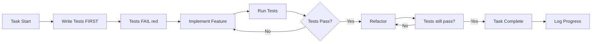

# CodeWeaver - Development Master Plan

**Professionelle Entwicklung eines Java-21/Gradle MCP Analysis Servers**

```
 ██████╗ ██████╗ ██████╗ ███████╗██╗    ██╗███████╗ █████╗ ██╗   ██╗███████╗██████╗
██╔════╝██╔═══██╗██╔══██╗██╔════╝██║    ██║██╔════╝██╔══██╗██║   ██║██╔════╝██╔══██╗
██║     ██║   ██║██║  ██║█████╗  ██║ █╗ ██║█████╗  ███████║██║   ██║█████╗  ██████╔╝
██║     ██║   ██║██║  ██║██╔══╝  ██║███╗██║██╔══╝  ██╔══██║╚██╗ ██╔╝██╔══╝  ██╔══██╗
╚██████╗╚██████╔╝██████╔╝███████╗╚███╔███╔╝███████╗██║  ██║ ╚████╔╝ ███████╗██║  ██║
 ╚═════╝ ╚═════╝ ╚═════╝ ╚══════╝ ╚══╝╚══╝ ╚══════╝╚═╝  ╚═╝  ╚═══╝  ╚══════╝╚═╝  ╚═╝
```

**Weaving Java Code Intelligence for LLMs**

---

## 1. Projektname & Vision

### Name: **CodeWeaver**

**Bedeutung**: "Webt" Code-Zusammenhänge, Abhängigkeiten und Kontexte in ein verständliches Netz für LLMs

**Tagline**: *"Weaving Java Code Intelligence for LLMs"*

**Package Name**: `@codeweaver/mcp-server`

**GitHub**: `codeweaver` oder `codeweaver-mcp`

### Alternativen (falls Name vergeben):
- **Javelin** - Schnell, präzise, zielgerichtet
- **CodePrism** - Zerlegt Code in analysierbare Komponenten
- **JavaBeacon** - Leuchtet Code aus für LLMs

---

## 2. LanceDB - Semantische Code-Suche

### Warum LanceDB? ✅

**LanceDB ist PERFEKT für deinen Use-Case!**

| Feature | FlexSearch | LanceDB | Gewinner |
|---------|------------|---------|----------|
| **Suche** | Keyword-basiert | **Semantisch** (Embeddings) | LanceDB |
| **"Find Similar"** | Nein | **Ja** | LanceDB |
| **Installation** | Pure JS | **Pure JS** (Node.js SDK) | Beide |
| **Performance** | Sehr schnell | Schnell (ANN-Index) | Beide |
| **Use Cases** | Exakte Pattern | **Konzeptsuche** | LanceDB |
| **Code-Verständnis** | Syntax | **Semantik** | LanceDB |

### Konkrete Use Cases für LanceDB

```typescript
// 1. "Finde ähnlichen Code" (statt exakter String-Suche)
const results = await lanceDB.search({
  query: "authentication and authorization logic",
  limit: 10
});
// Findet: login(), authorize(), checkPermissions(), etc.

// 2. "Finde Code der ähnliches tut"
const similar = await lanceDB.findSimilar({
  codeSnippet: "public void saveUser(User user) { repo.save(user); }",
  limit: 5
});
// Findet: saveProduct(), createOrder(), etc. (ähnliche Patterns)

// 3. "Finde alle Methoden die mit Datenbank arbeiten"
const dbMethods = await lanceDB.search({
  query: "database operations, persistence, CRUD",
  filter: { kind: 'method' }
});
```

### Architektur-Integration

```
┌─────────────────────────────────────┐
│         MCP Server                  │
├─────────────────────────────────────┤
│  ┌──────────────┐  ┌─────────────┐ │
│  │ LanceDB      │  │ JsonSymbol  │ │
│  │ (Semantic)   │  │ Store       │ │
│  │              │  │ (Exact)     │ │
│  │ - Code Emb.  │  │ - Defs      │ │
│  │ - Similar    │  │ - Refs      │ │
│  │ - Concept    │  │ - Lookup    │ │
│  └──────────────┘  └─────────────┘ │
└─────────────────────────────────────┘
```

**Strategie**:
- **LanceDB** für semantische Suche ("find similar", "find by concept")
- **JsonSymbolStore** für exakte Lookups (Definitionen, Referenzen)

### Dependencies Update

```json
{
  "dependencies": {
    "@modelcontextprotocol/sdk": "^1.0.4",
    "vectordb": "^0.4.0",              // LanceDB Node.js SDK
    "@xenova/transformers": "^2.17.0", // Embeddings (all-MiniLM-L6-v2)
    "simple-git": "^3.27.0",
    "java-parser": "^2.3.0",
    "fast-xml-parser": "^4.5.0",
    "chokidar": "^4.0.3",
    "zod": "^3.24.1"
  }
}
```

**Embeddings-Modell**: `all-MiniLM-L6-v2` (384-dim, schnell, offline-fähig!)

---

## 3. Progress-Tracking-System

### Progress-Datei: `.codeweaver/progress.jsonl`

**Format**: JSON Lines (eine Zeile pro Event)

```jsonl
{"timestamp":"2025-01-13T17:30:00.123Z","level":"milestone","phase":"foundation","status":"started","agent":"orchestrator","message":"Starting Phase 1: Foundation"}
{"timestamp":"2025-01-13T17:30:01.456Z","level":"task","phase":"foundation","task":"mcp-server-skeleton","status":"started","agent":"foundation-agent","message":"Creating MCP server skeleton"}
{"timestamp":"2025-01-13T17:30:05.789Z","level":"test","phase":"foundation","task":"mcp-server-skeleton","test":"server.test.ts","status":"passed","agent":"foundation-agent","message":"MCPServer.start() test passed"}
{"timestamp":"2025-01-13T17:30:10.012Z","level":"task","phase":"foundation","task":"mcp-server-skeleton","status":"completed","agent":"foundation-agent","duration":8556,"message":"MCP server skeleton completed"}
{"timestamp":"2025-01-13T17:32:00.000Z","level":"checkpoint","phase":"foundation","tasks_completed":5,"tasks_total":12,"progress":0.42,"message":"Checkpoint: 5/12 tasks completed"}
```

### Progress-Schema

```typescript
interface ProgressEntry {
  timestamp: string;              // ISO 8601
  level: ProgressLevel;
  phase: PhaseName;
  task?: string;                  // Task-ID
  test?: string;                  // Test-File
  status: Status;
  agent: string;                  // Agent-Name
  duration?: number;              // Milliseconds
  message: string;
  metadata?: Record<string, any>; // Zusätzliche Infos
}

type ProgressLevel =
  | 'milestone'   // Phase start/end
  | 'task'        // Task start/complete
  | 'test'        // Test pass/fail
  | 'checkpoint'  // Periodic save
  | 'error';      // Fehler

type Status =
  | 'started'
  | 'in_progress'
  | 'completed'
  | 'failed'
  | 'skipped'
  | 'passed';     // Für Tests

type PhaseName =
  | 'foundation'
  | 'indexing'
  | 'analysis'
  | 'orchestration'
  | 'optimization';
```

### Progress-Writer

```typescript
// src/utils/progress-writer.ts

import fs from 'fs';
import path from 'path';

export class ProgressWriter {
  private stream: fs.WriteStream;
  private progressFile = '.codeweaver/progress.jsonl';

  constructor() {
    fs.mkdirSync('.codeweaver', { recursive: true });
    this.stream = fs.createWriteStream(this.progressFile, { flags: 'a' });
  }

  log(entry: Omit<ProgressEntry, 'timestamp'>): void {
    const fullEntry: ProgressEntry = {
      timestamp: new Date().toISOString(),
      ...entry
    };

    this.stream.write(JSON.stringify(fullEntry) + '\n');

    // Auch in Console (mit Farben)
    this.logToConsole(fullEntry);
  }

  milestone(phase: PhaseName, status: Status, message: string): void {
    this.log({ level: 'milestone', phase, status, agent: 'orchestrator', message });
  }

  taskStarted(phase: PhaseName, task: string, agent: string): void {
    this.log({ level: 'task', phase, task, status: 'started', agent, message: `Starting ${task}` });
  }

  taskCompleted(phase: PhaseName, task: string, agent: string, duration: number): void {
    this.log({ level: 'task', phase, task, status: 'completed', agent, duration, message: `Completed ${task}` });
  }

  testPassed(phase: PhaseName, task: string, test: string, agent: string): void {
    this.log({ level: 'test', phase, task, test, status: 'passed', agent, message: `Test passed: ${test}` });
  }

  checkpoint(phase: PhaseName, completed: number, total: number): void {
    this.log({
      level: 'checkpoint',
      phase,
      status: 'in_progress',
      agent: 'orchestrator',
      message: `Checkpoint: ${completed}/${total} tasks completed`,
      metadata: { tasks_completed: completed, tasks_total: total, progress: completed / total }
    });
  }

  error(phase: PhaseName, task: string, agent: string, error: Error): void {
    this.log({
      level: 'error',
      phase,
      task,
      status: 'failed',
      agent,
      message: error.message,
      metadata: { stack: error.stack }
    });
  }

  private logToConsole(entry: ProgressEntry): void {
    const colors = {
      milestone: '\x1b[35m', // Magenta
      task: '\x1b[36m',      // Cyan
      test: '\x1b[32m',      // Green
      checkpoint: '\x1b[33m', // Yellow
      error: '\x1b[31m'      // Red
    };
    const reset = '\x1b[0m';

    const color = colors[entry.level];
    console.log(`${color}[${entry.level.toUpperCase()}]${reset} ${entry.message}`);
  }
}
```

### Nutzung in Agents

```typescript
// src/agents/foundation-agent.ts

export class FoundationAgent {
  private progress = new ProgressWriter();

  async execute(): Promise<void> {
    this.progress.taskStarted('foundation', 'mcp-server-skeleton', 'foundation-agent');

    const startTime = Date.now();

    try {
      // Implementierung...
      await this.createMCPServer();

      // Tests ausführen
      await this.runTests();

      const duration = Date.now() - startTime;
      this.progress.taskCompleted('foundation', 'mcp-server-skeleton', 'foundation-agent', duration);

    } catch (error) {
      this.progress.error('foundation', 'mcp-server-skeleton', 'foundation-agent', error as Error);
      throw error;
    }
  }

  private async runTests(): Promise<void> {
    const tests = ['server.test.ts', 'tools.test.ts'];
    for (const test of tests) {
      // Run test...
      this.progress.testPassed('foundation', 'mcp-server-skeleton', test, 'foundation-agent');
    }
  }
}
```

---

## 4. Checkpoint/Resume-Mechanismus

### Checkpoint-Datei: `.codeweaver/checkpoint.json`

```json
{
  "version": "1.0.0",
  "lastCheckpoint": "2025-01-13T17:45:00.000Z",
  "currentPhase": "foundation",
  "completedTasks": [
    "mcp-server-skeleton",
    "discovery-agent",
    "cache-agent"
  ],
  "inProgressTasks": [
    "json-symbol-store"
  ],
  "pendingTasks": [
    "snippets-agent",
    "gradle-runner"
  ],
  "testResults": {
    "passed": 12,
    "failed": 0,
    "skipped": 3
  },
  "artifacts": {
    "src/mcp/server.ts": "abc123...",
    "src/agents/discovery.ts": "def456..."
  }
}
```

### Checkpoint-Manager

```typescript
// src/utils/checkpoint-manager.ts

export class CheckpointManager {
  private checkpointFile = '.codeweaver/checkpoint.json';

  async save(state: DevelopmentState): Promise<void> {
    const checkpoint: Checkpoint = {
      version: '1.0.0',
      lastCheckpoint: new Date().toISOString(),
      currentPhase: state.currentPhase,
      completedTasks: state.completedTasks,
      inProgressTasks: state.inProgressTasks,
      pendingTasks: state.pendingTasks,
      testResults: state.testResults,
      artifacts: await this.hashArtifacts(state.artifacts)
    };

    await fs.writeFile(this.checkpointFile, JSON.stringify(checkpoint, null, 2));
  }

  async load(): Promise<Checkpoint | null> {
    if (!fs.existsSync(this.checkpointFile)) return null;
    const data = await fs.readFile(this.checkpointFile, 'utf-8');
    return JSON.parse(data);
  }

  async resume(): Promise<DevelopmentState> {
    const checkpoint = await this.load();
    if (!checkpoint) {
      throw new Error('No checkpoint found. Starting fresh.');
    }

    console.log(`Resuming from checkpoint: ${checkpoint.lastCheckpoint}`);
    console.log(`Phase: ${checkpoint.currentPhase}`);
    console.log(`Completed: ${checkpoint.completedTasks.length} tasks`);
    console.log(`Pending: ${checkpoint.pendingTasks.length} tasks`);

    return this.checkpointToState(checkpoint);
  }

  private async hashArtifacts(files: string[]): Promise<Record<string, string>> {
    const hashes: Record<string, string> = {};
    for (const file of files) {
      const content = await fs.readFile(file, 'utf-8');
      hashes[file] = crypto.createHash('sha256').update(content).digest('hex');
    }
    return hashes;
  }
}
```

### Resume-Workflow

```bash
# Nach Unterbrechung
npm run dev

# System erkennt Checkpoint und fragt:
? Found checkpoint from 2025-01-13T17:45:00.000Z. Resume? (Y/n)

# Bei "Y":
✓ Resuming from Phase: foundation
✓ Completed tasks: 3/12
✓ Next task: json-symbol-store
✓ Starting...
```

---

## 5. Test-Driven Development (TDD) Strategie

### TDD-Workflow pro Task



### Beispiel: MCP Server Skeleton

#### Schritt 1: Test schreiben (FIRST!)

```typescript
// tests/unit/mcp/server.test.ts

describe('MCPServer', () => {
  it('should start and listen on stdio', async () => {
    const server = new MCPServer();
    await server.start();
    expect(server.isRunning()).toBe(true);
  });

  it('should register tools', () => {
    const server = new MCPServer();
    server.registerTool('test-tool', async () => ({ result: 'ok' }));
    expect(server.getTools()).toContain('test-tool');
  });

  it('should handle tool calls', async () => {
    const server = new MCPServer();
    server.registerTool('echo', async (args) => ({ echo: args }));
    const result = await server.callTool('echo', { msg: 'hello' });
    expect(result.echo.msg).toBe('hello');
  });
});
```

#### Schritt 2: Test ausführen (MUSS FEHLSCHLAGEN!)

```bash
npm run test:unit
# ❌ FAIL: MCPServer is not defined
```

#### Schritt 3: Implementieren

```typescript
// src/mcp/server.ts

export class MCPServer {
  private running = false;
  private tools = new Map<string, ToolHandler>();

  async start(): Promise<void> {
    // Implementation...
    this.running = true;
  }

  isRunning(): boolean {
    return this.running;
  }

  registerTool(name: string, handler: ToolHandler): void {
    this.tools.set(name, handler);
  }

  getTools(): string[] {
    return Array.from(this.tools.keys());
  }

  async callTool(name: string, args: any): Promise<any> {
    const handler = this.tools.get(name);
    if (!handler) throw new Error(`Tool ${name} not found`);
    return handler(args);
  }
}
```

#### Schritt 4: Test ausführen (MUSS PASSEN!)

```bash
npm run test:unit
# ✅ PASS: All tests passed
```

#### Schritt 5: Progress loggen

```typescript
this.progress.testPassed('foundation', 'mcp-server-skeleton', 'server.test.ts', 'foundation-agent');
this.progress.taskCompleted('foundation', 'mcp-server-skeleton', 'foundation-agent', 8556);
```

---

## 6. Agent-basierte Parallelisierung

### Development Agents

```typescript
interface DevelopmentAgent {
  name: string;
  phase: PhaseName;
  tasks: string[];
  dependencies: string[];           // Agent-Namen
  execute(): Promise<AgentResult>;
}
```

### Agent-Definition

```typescript
// .codeweaver/agents.config.ts

export const DEVELOPMENT_AGENTS: DevelopmentAgent[] = [
  // Phase 1: Foundation
  {
    name: 'foundation-mcp',
    phase: 'foundation',
    tasks: ['mcp-server-skeleton', 'mcp-tools-registry'],
    dependencies: [],
    execute: async () => { /* ... */ }
  },
  {
    name: 'foundation-discovery',
    phase: 'foundation',
    tasks: ['discovery-agent', 'project-metadata-parser'],
    dependencies: [],
    execute: async () => { /* ... */ }
  },
  {
    name: 'foundation-cache',
    phase: 'foundation',
    tasks: ['cache-agent', 'json-symbol-store'],
    dependencies: [],
    execute: async () => { /* ... */ }
  },

  // Phase 2: Indexing (parallel nach Foundation)
  {
    name: 'indexing-lancedb',
    phase: 'indexing',
    tasks: ['lancedb-setup', 'embeddings-generator', 'semantic-search'],
    dependencies: ['foundation-mcp', 'foundation-cache'],
    execute: async () => { /* ... */ }
  },
  {
    name: 'indexing-symbols',
    phase: 'indexing',
    tasks: ['java-parser', 'symbol-extractor', 'reference-resolver'],
    dependencies: ['foundation-cache'],
    execute: async () => { /* ... */ }
  },

  // ... weitere Agents
];
```

### Orchestrator für parallele Ausführung

```typescript
// src/orchestrator/development-orchestrator.ts

export class DevelopmentOrchestrator {
  private progress = new ProgressWriter();
  private checkpoint = new CheckpointManager();

  async execute(): Promise<void> {
    const state = await this.checkpoint.load() || this.initialState();

    this.progress.milestone(state.currentPhase, 'started', `Starting ${state.currentPhase}`);

    // Finde ausführbare Agents (Dependencies erfüllt)
    const executableAgents = this.findExecutableAgents(state);

    // Führe parallel aus
    await Promise.all(
      executableAgents.map(agent => this.executeAgent(agent, state))
    );

    // Checkpoint nach jedem Agent
    await this.checkpoint.save(state);

    // Nächste Phase?
    if (state.pendingTasks.length === 0) {
      await this.advancePhase(state);
    }
  }

  private async executeAgent(agent: DevelopmentAgent, state: DevelopmentState): Promise<void> {
    this.progress.milestone(agent.phase, 'started', `Agent ${agent.name} starting`);

    try {
      const result = await agent.execute();

      // Update State
      state.completedTasks.push(...agent.tasks);
      state.pendingTasks = state.pendingTasks.filter(t => !agent.tasks.includes(t));

      this.progress.milestone(agent.phase, 'completed', `Agent ${agent.name} completed`);

    } catch (error) {
      this.progress.error(agent.phase, agent.name, agent.name, error as Error);
      throw error;
    }
  }

  private findExecutableAgents(state: DevelopmentState): DevelopmentAgent[] {
    return DEVELOPMENT_AGENTS.filter(agent => {
      // Agent gehört zu aktueller Phase
      if (agent.phase !== state.currentPhase) return false;

      // Tasks noch nicht erledigt
      if (agent.tasks.every(t => state.completedTasks.includes(t))) return false;

      // Dependencies erfüllt?
      return agent.dependencies.every(dep => {
        const depAgent = DEVELOPMENT_AGENTS.find(a => a.name === dep);
        return depAgent?.tasks.every(t => state.completedTasks.includes(t));
      });
    });
  }
}
```

---

## 7. Meilensteine & Deliverables

### Meilenstein 1: Foundation (Woche 1-2)
**Ziel**: Basis-Infrastruktur steht

**Deliverables**:
- ✅ MCP Server läuft (stdio, JSON-RPC)
- ✅ 2 MCP-Tools (`project.meta`, `file.readRange`)
- ✅ Discovery Agent funktioniert
- ✅ JsonSymbolStore funktioniert
- ✅ Cache-System funktioniert
- ✅ Progress-Tracking aktiv
- ✅ 50+ Unit-Tests (grün)

**Acceptance Criteria**:
```bash
npm run test:unit
# ✅ 50/50 tests passed

node dist/index.js
# ✅ MCP Server listening on stdio

# Test MCP-Call:
echo '{"jsonrpc":"2.0","method":"tools/call","params":{"name":"project.meta","arguments":{}},"id":1}' | node dist/index.js
# ✅ Returns ProjectMetadata
```

---

### Meilenstein 2: Indexing (Woche 3-4)
**Ziel**: Vollständige Index-Infrastruktur

**Deliverables**:
- ✅ LanceDB-Integration (Embeddings, semantische Suche)
- ✅ JsonSymbolStore mit Definitionen/Referenzen
- ✅ Java-Parser (Klassen, Methoden, Felder)
- ✅ Search Agent (keyword + semantic)
- ✅ Symbols Agent (Definition/Reference-Lookup)
- ✅ 4 neue MCP-Tools (`search.find`, `search.semantic`, `symbols.lookup`, `index.refresh`)
- ✅ 100+ Unit-Tests

**Acceptance Criteria**:
```bash
# Semantic Search funktioniert
npm run test:integration -- search-semantic.test.ts
# ✅ Finds "authentication logic" → login(), authorize(), checkPermissions()

# Symbol-Lookup funktioniert
npm run test:integration -- symbols-lookup.test.ts
# ✅ Finds all references to MyClass#myMethod
```

---

### Meilenstein 3: Analysis (Woche 5-6)
**Ziel**: Statische Analyse & Reports

**Deliverables**:
- ✅ Gradle-Runner (compile, test)
- ✅ SpotBugs-Integration
- ✅ Checkstyle-Integration
- ✅ Analysis Agent (Report-Aggregation)
- ✅ 1 neues MCP-Tool (`analysis.getReports`)
- ✅ 150+ Unit-Tests

---

### Meilenstein 4: Orchestration (Woche 7)
**Ziel**: Vollständige Pipeline

**Deliverables**:
- ✅ VCS/Diff Agent (Git-Integration)
- ✅ Orchestrator Agent (DAG-Pipeline)
- ✅ Parallele Ausführung
- ✅ 1 neues MCP-Tool (`vcs.diff`)
- ✅ 180+ Unit-Tests

---

### Meilenstein 5: Production-Ready (Woche 8-9)
**Ziel**: Poliert, dokumentiert, getestet

**Deliverables**:
- ✅ Token-Budget enforced
- ✅ Performance-Optimierungen
- ✅ E2E-Tests mit 3 Test-Projekten
- ✅ Vollständige Dokumentation
- ✅ 200+ Tests (>85% Coverage)
- ✅ README, Tutorials, Beispiele

---

## 8. Usage-Guide (Vorab)

### Wie arbeitet man mit CodeWeaver?

#### Szenario 1: Projekt analysieren

```bash
# 1. CodeWeaver in Java-Projekt starten
cd /path/to/my-java-project
npx @codeweaver/mcp-server

# 2. In Claude Code: MCP-Server ist verfügbar
# User fragt: "Was macht die Klasse UserService?"

# 3. Claude nutzt MCP-Tools:
await mcp.call('symbols.lookup', {
  qualifiedName: 'com.example.UserService',
  operation: 'definition'
});
# → Gibt Definition mit Javadoc, Methoden, etc.

await mcp.call('search.semantic', {
  query: 'user management and authentication',
  limit: 10
});
# → Findet UserService, AuthService, PermissionChecker, ...

await mcp.call('file.readRange', {
  path: 'src/main/java/com/example/UserService.java',
  startLine: 42,
  endLine: 65
});
# → Gibt gezielten Snippet (20 Zeilen)
```

#### Szenario 2: Bugs finden

```bash
# User: "Finde alle potentiellen Null-Pointer-Exceptions"

# Claude ruft:
await mcp.call('analysis.getReports', {
  types: ['spotbugs']
});
# → Gibt strukturierte Findings zurück

await mcp.call('file.readRange', {
  path: 'src/.../Service.java',
  startLine: 140,
  endLine: 150
});
# → Zeigt problematischen Code

# Claude schlägt Fix vor
```

#### Szenario 3: Refactoring

```bash
# User: "Finde alle Stellen wo MyClass verwendet wird"

await mcp.call('symbols.lookup', {
  qualifiedName: 'com.example.MyClass',
  operation: 'references'
});
# → Liste aller Verwendungsstellen

# User: "Zeige mir die wichtigsten 3"
await mcp.call('file.readRange', { path: '...', ... });
await mcp.call('file.readRange', { path: '...', ... });
await mcp.call('file.readRange', { path: '...', ... });
```

#### Szenario 4: Semantische Code-Suche

```bash
# User: "Zeige mir allen Code der mit Datenbankzugriffen zu tun hat"

await mcp.call('search.semantic', {
  query: "database access, SQL queries, repository pattern, data persistence",
  limit: 20
});
# → Findet: UserRepository, OrderRepository, DatabaseConfig, QueryBuilder, ...

# Für jeden Treffer:
await mcp.call('file.readRange', { ... });
```

---

## 9. Implementierungs-Zeitplan mit TDD & Agents

### Woche 1: Foundation (Tag 1-7)

| Tag | Agent | Tasks | Tests | Status |
|-----|-------|-------|-------|--------|
| **1** | foundation-mcp | MCP Server Skeleton | server.test.ts, tools.test.ts | 🔄 |
| **2** | foundation-discovery | Discovery Agent | discovery.test.ts | 🔄 |
| **3** | foundation-cache | Cache Agent, JsonSymbolStore | cache.test.ts, json-store.test.ts | 🔄 |
| **4** | foundation-snippets | Snippets Agent | snippets.test.ts | 🔄 |
| **5** | foundation-integration | MCP Tools Integration | mcp-tools.test.ts | 🔄 |
| **6-7** | foundation-testing | E2E-Tests, Fixes | simple-java.test.ts | 🔄 |

**Parallel-Agents**: Tag 1-3 können 3 Agents parallel laufen!

---

### Woche 2: Foundation Abschluss (Tag 8-14)

| Tag | Agent | Tasks | Tests | Status |
|-----|-------|-------|-------|--------|
| **8-9** | foundation-polish | Refactoring, Docs | - | 🔄 |
| **10** | - | **Meilenstein 1 Review** | - | 🔄 |
| **11-14** | indexing-prep | LanceDB Setup, Embeddings | lancedb.test.ts | 🔄 |

---

### Woche 3-4: Indexing (Tag 15-28)

| Tag | Agent | Tasks | Tests | Status |
|-----|-------|-------|-------|--------|
| **15-17** | indexing-lancedb | LanceDB, Embeddings, Semantic Search | semantic-search.test.ts | 🔄 |
| **15-17** | indexing-symbols | Java-Parser, Symbol-Extractor | java-parser.test.ts | 🔄 (parallel) |
| **18-20** | indexing-search | Search Agent (keyword + semantic) | search.test.ts | 🔄 |
| **21-23** | indexing-symbols-agent | Symbols Agent (Def/Refs) | symbols.test.ts | 🔄 |
| **24-26** | indexing-integration | MCP Tools, Integration | indexing-integration.test.ts | 🔄 |
| **27-28** | - | **Meilenstein 2 Review** | - | 🔄 |

**Parallel-Agents**: indexing-lancedb & indexing-symbols können parallel!

---

### Woche 5-6: Analysis (Tag 29-42)

| Tag | Agent | Tasks | Tests | Status |
|-----|-------|-------|-------|--------|
| **29-31** | analysis-gradle | Gradle-Runner | gradle-runner.test.ts | 🔄 |
| **29-31** | analysis-spotbugs | SpotBugs-Integration | spotbugs.test.ts | 🔄 (parallel) |
| **32-34** | analysis-checkstyle | Checkstyle-Integration | checkstyle.test.ts | 🔄 |
| **35-37** | analysis-agent | Analysis Agent (Aggregation) | analysis.test.ts | 🔄 |
| **38-40** | analysis-integration | MCP Tool, Integration | analysis-integration.test.ts | 🔄 |
| **41-42** | - | **Meilenstein 3 Review** | - | 🔄 |

---

### Woche 7: Orchestration (Tag 43-49)

| Tag | Agent | Tasks | Tests | Status |
|-----|-------|-------|-------|--------|
| **43-44** | orchestration-vcs | VCS/Diff Agent | vcs.test.ts | 🔄 |
| **45-47** | orchestration-orchestrator | Orchestrator Agent, DAG | orchestrator.test.ts, dag.test.ts | 🔄 |
| **48** | orchestration-integration | Pipeline-Integration | pipeline.test.ts | 🔄 |
| **49** | - | **Meilenstein 4 Review** | - | 🔄 |

---

### Woche 8-9: Optimization (Tag 50-63)

| Tag | Agent | Tasks | Tests | Status |
|-----|-------|-------|-------|--------|
| **50-52** | optimization-token | Token-Budget-Enforcement | token-estimator.test.ts | 🔄 |
| **53-55** | optimization-perf | Performance-Optimierungen | perf.test.ts | 🔄 |
| **56-58** | optimization-e2e | E2E-Tests (3 Projekte) | e2e/*.test.ts | 🔄 |
| **59-61** | optimization-docs | Docs, Tutorials, Beispiele | - | 🔄 |
| **62-63** | - | **Meilenstein 5 / RELEASE** | - | 🔄 |

---

## 10. Kommandos

### Development starten

```bash
# Frisch starten
npm run dev:start

# Von Checkpoint fortsetzen
npm run dev:resume

# Spezifischen Agent ausführen
npm run dev:agent foundation-mcp

# Progress anzeigen
npm run dev:progress

# Checkpoint manuell erstellen
npm run dev:checkpoint
```

### Scripts (package.json)

```json
{
  "scripts": {
    "dev:start": "tsx src/dev-orchestrator/index.ts --fresh",
    "dev:resume": "tsx src/dev-orchestrator/index.ts --resume",
    "dev:agent": "tsx src/dev-orchestrator/index.ts --agent",
    "dev:progress": "tsx src/dev-orchestrator/progress-viewer.ts",
    "dev:checkpoint": "tsx src/dev-orchestrator/checkpoint.ts",

    "test:tdd": "vitest --watch",
    "test:unit": "vitest run --dir tests/unit",
    "test:integration": "vitest run --dir tests/integration",
    "test:e2e": "vitest run --dir tests/e2e",
    "test:coverage": "vitest run --coverage"
  }
}
```

---

## 11. Zusammenfassung

### ✅ Was haben wir geklärt?

1. **Projektname**: **CodeWeaver** 🕸️
2. **LanceDB**: ✅ Ja! Für semantische Code-Suche
3. **Progress-Tracking**: JSON Lines Format (`.codeweaver/progress.jsonl`)
4. **TDD**: Tests ZUERST, dann Implementation
5. **Agent-Parallelisierung**: 3-5 Agents parallel pro Phase
6. **Checkpoint/Resume**: Jederzeit unterbrechen & fortsetzen
7. **Meilensteine**: 5 klare Meilensteine über 9 Wochen
8. **Usage-Guide**: 4 konkrete Szenarien dokumentiert

### 📊 Fortschritts-Dashboards

```bash
npm run dev:progress

# Output:
╔══════════════════════════════════════════════╗
║        CodeWeaver Development Progress       ║
╠══════════════════════════════════════════════╣
║ Phase:      Foundation                       ║
║ Progress:   3/12 tasks (25%)                 ║
║ Tests:      50 passed, 0 failed              ║
║ Duration:   2h 15min                         ║
║ Next:       json-symbol-store                ║
╚══════════════════════════════════════════════╝
```

---

## 12. Nächste Schritte

1. **Namen finalisieren**: CodeWeaver OK? Alternativen?
2. **LanceDB testen**: Kleines Proof-of-Concept
3. **Development starten**: Foundation Agent 1

Bereit loszulegen? 🚀
