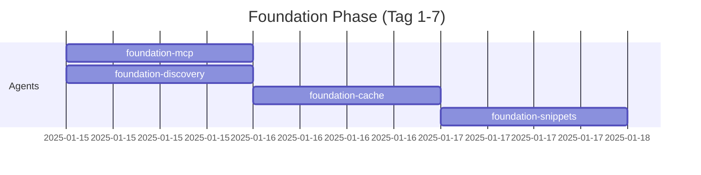

# CodeWeaver - Projekt-Zusammenfassung

```
 ██████╗ ██████╗ ██████╗ ███████╗██╗    ██╗███████╗ █████╗ ██╗   ██╗███████╗██████╗
██╔════╝██╔═══██╗██╔══██╗██╔════╝██║    ██║██╔════╝██╔══██╗██║   ██║██╔════╝██╔══██╗
██║     ██║   ██║██║  ██║█████╗  ██║ █╗ ██║█████╗  ███████║██║   ██║█████╗  ██████╔╝
██║     ██║   ██║██║  ██║██╔══╝  ██║███╗██║██╔══╝  ██╔══██║╚██╗ ██╔╝██╔══╝  ██╔══██╗
╚██████╗╚██████╔╝██████╔╝███████╗╚███╔███╔╝███████╗██║  ██║ ╚████╔╝ ███████╗██║  ██║
 ╚═════╝ ╚═════╝ ╚═════╝ ╚══════╝ ╚══╝╚══╝ ╚══════╝╚═╝  ╚═╝  ╚═══╝  ╚══════╝╚═╝  ╚═╝
```

**Weaving Java Code Intelligence for LLMs**

---

## 🎯 Was ist CodeWeaver?

Ein **tokenarmer MCP-Server** für Java-21/Gradle-Projekte mit **Dual-Mode-Interface**:

- 🕸️ **Multi-Agenten-Architektur** (9 spezialisierte Agents)
- 🔍 **Semantische Code-Suche** (LanceDB + Embeddings)
- 📊 **Statische Analyse** (SpotBugs, Checkstyle)
- ⚡ **Zero Native Dependencies** (100% Pure Node.js)
- 🎯 **Token-Effizienz** (niemals komplette Dateien, max. 10k Tokens/Response)
- 🔄 **Dual-Mode**: CLI (Terminal) + MCP Server (LLM-Integration) mit geteilter Codebasis

---

## 📚 Dokumentations-Übersicht

| Datei | Beschreibung | Größe |
|-------|--------------|-------|
| **README.md** | Hauptdokumentation, Features, Installation | 9 KB |
| **QUICKSTART.md** | Schnellstart-Guide (Pure Node.js) | 6 KB |
| **PROJECT_MASTER_PLAN.md** | ⭐ **Entwicklungsplan, TDD, Progress-Tracking** | 25 KB |
| **ARCHITECTURE.md** | System-Architektur, Agenten, MCP-Tools | 35 KB |
| **DATA_MODELS.md** | Datenstrukturen, Schemas | 22 KB |
| **PROJECT_STRUCTURE.md** | Verzeichnisstruktur | 14 KB |
| **IMPLEMENTATION_ROADMAP.md** | 9-Wochen-Implementierungsplan | 22 KB |
| **docs/DUAL_MODE_ARCHITECTURE.md** | ⭐ **CLI + MCP Dual-Mode (geteilte Codebasis)** | 20 KB |
| **docs/LIGHTWEIGHT_ARCHITECTURE.md** | JSON-basierte Architektur (statt SQLite) | 15 KB |
| **docs/TOKEN_MANAGEMENT.md** | Token-Budget-Implementierung | 13 KB |
| **docs/TESTING.md** | Test-Strategie (Unit/Integration/E2E) | 25 KB |

**Gesamt**: ~206 KB hochwertige Dokumentation! 📖

---

## 🚀 Schnellstart

```bash
# 1. Dependencies installieren (30 Sekunden!)
npm install

# 2. Build
npm run build

# 3. Development starten
npm run dev:start

# Oder von Checkpoint fortsetzen
npm run dev:resume
```

---

## 🏗️ Architektur-Highlights

### Multi-Agenten-System

```
Orchestrator Agent (Steuerung)
├── Discovery Agent (Projekterkennung)
├── Index Agent (LanceDB + JsonSymbolStore)
├── Search Agent (Semantic + Keyword)
├── Symbols Agent (Definitionen/Referenzen)
├── Analysis Agent (Gradle, SpotBugs, Checkstyle)
├── Snippets Agent (Code-Ausschnitte)
├── VCS/Diff Agent (Git-Integration)
└── Cache Agent (Content-Addressable Storage)
```

### LanceDB für Semantische Suche ✅

**Warum LanceDB?**
- ✅ Pure JavaScript (keine Python!)
- ✅ Embeddings-basierte Suche ("find similar code")
- ✅ Leichtgewichtig (lokale Vektordatenbank)
- ✅ Besser als Keyword-Suche für konzeptuelle Queries

**Beispiel**:
```typescript
// Finde allen Code der mit "authentication" zu tun hat
await mcp.call('search.semantic', {
  query: "user authentication and authorization logic",
  limit: 10
});
// → Findet: login(), authorize(), checkPermissions(), etc.
```

### JSON Lines statt SQLite

**Symbol-Index**: `.codeweaver/index/symbols.jsonl`
```jsonl
{"type":"symbol","id":"com.example.MyClass","kind":"class",...}
{"type":"symbol","id":"com.example.MyClass#myMethod","kind":"method",...}
{"type":"reference","from":{"path":"Service.java","line":42},"to":"..."}
```

**Vorteile**:
- Zero Installation (keine node-gyp)
- Human-readable (Debugging einfach)
- In-Memory Maps = O(1) Lookups

---

## 📈 Progress-Tracking

### Format: `.codeweaver/progress.jsonl`

```jsonl
{"timestamp":"2025-01-13T17:30:00Z","level":"milestone","phase":"foundation","status":"started","agent":"orchestrator","message":"Starting Phase 1"}
{"timestamp":"2025-01-13T17:30:05Z","level":"task","phase":"foundation","task":"mcp-server-skeleton","status":"started","agent":"foundation-mcp","message":"Creating MCP server"}
{"timestamp":"2025-01-13T17:30:10Z","level":"test","phase":"foundation","task":"mcp-server-skeleton","test":"server.test.ts","status":"passed","agent":"foundation-mcp"}
{"timestamp":"2025-01-13T17:30:15Z","level":"task","phase":"foundation","task":"mcp-server-skeleton","status":"completed","agent":"foundation-mcp","duration":10000}
{"timestamp":"2025-01-13T17:35:00Z","level":"checkpoint","phase":"foundation","status":"in_progress","message":"Checkpoint: 1/12 tasks completed"}
```

### Dashboard

```bash
npm run dev:progress

╔══════════════════════════════════════════════╗
║        CodeWeaver Development Progress       ║
╠══════════════════════════════════════════════╣
║ Phase:      Foundation                       ║
║ Progress:   1/12 tasks (8.3%)                ║
║ Tests:      12 passed, 0 failed              ║
║ Duration:   25 minutes                       ║
║ Next:       discovery-agent                  ║
╚══════════════════════════════════════════════╝
```

---

## ✅ Test-Driven Development (TDD)

### Workflow pro Task

1. **Test schreiben** (FIRST!)
2. **Test ausführen** (MUSS FEHLSCHLAGEN!)
3. **Implementieren**
4. **Test ausführen** (MUSS PASSEN!)
5. **Refactorn**
6. **Progress loggen**

### Beispiel

```typescript
// Schritt 1: Test (FIRST!)
describe('MCPServer', () => {
  it('should start and listen on stdio', async () => {
    const server = new MCPServer();
    await server.start();
    expect(server.isRunning()).toBe(true);
  });
});

// Schritt 2: Test ausführen → ❌ FAIL (gut!)

// Schritt 3: Implementieren
export class MCPServer {
  async start() { /* ... */ }
  isRunning() { /* ... */ }
}

// Schritt 4: Test ausführen → ✅ PASS (perfekt!)

// Schritt 5: Progress loggen
progress.testPassed('foundation', 'mcp-server-skeleton', 'server.test.ts', 'foundation-mcp');
```

---

## 🔄 Checkpoint/Resume-System

### Checkpoint: `.codeweaver/checkpoint.json`

```json
{
  "lastCheckpoint": "2025-01-13T17:45:00Z",
  "currentPhase": "foundation",
  "completedTasks": ["mcp-server-skeleton", "discovery-agent"],
  "inProgressTasks": ["json-symbol-store"],
  "pendingTasks": ["snippets-agent", "gradle-runner"],
  "testResults": { "passed": 25, "failed": 0 }
}
```

### Resume-Workflow

```bash
npm run dev:resume

? Found checkpoint from 2025-01-13T17:45:00Z. Resume? (Y/n) Y
✓ Resuming from Phase: foundation
✓ Completed tasks: 2/12
✓ Next task: json-symbol-store
✓ Starting...
```

**= Jederzeit unterbrechen & fortsetzen!**

---

## 🎯 Meilensteine

### M1: Foundation (Woche 1-2)
- ✅ MCP Server läuft
- ✅ 2 MCP-Tools funktionieren
- ✅ 50+ Unit-Tests

### M2: Indexing (Woche 3-4)
- ✅ LanceDB-Integration (semantische Suche)
- ✅ JsonSymbolStore (Definitionen/Referenzen)
- ✅ 4 neue MCP-Tools
- ✅ 100+ Unit-Tests

### M3: Analysis (Woche 5-6)
- ✅ Gradle-Runner, SpotBugs, Checkstyle
- ✅ 1 neues MCP-Tool
- ✅ 150+ Unit-Tests

### M4: Orchestration (Woche 7)
- ✅ Git-Integration, DAG-Pipeline
- ✅ 1 neues MCP-Tool
- ✅ 180+ Unit-Tests

### M5: Production-Ready (Woche 8-9)
- ✅ Token-Budget enforced
- ✅ Performance optimiert
- ✅ E2E-Tests
- ✅ 200+ Tests, >85% Coverage

---

## 🛠️ MCP-Tools (7 Stück)

| Tool | Beschreibung | Use Case |
|------|--------------|----------|
| `project.meta` | Projekt-Metadaten | "Welche Java-Version nutzt das Projekt?" |
| `search.find` | Keyword-Suche | "Finde alle NullPointerException" |
| `search.semantic` | Semantische Suche | "Finde Authentication-Logic" |
| `symbols.lookup` | Symbol-Definitionen/Referenzen | "Wo wird MyClass#myMethod verwendet?" |
| `analysis.getReports` | Compile/Test/Static Analysis | "Zeige alle SpotBugs-Findings" |
| `file.readRange` | Code-Snippets | "Zeige Zeilen 42-65 von Service.java" |
| `vcs.diff` | Git-Diffs | "Was wurde in diesem Branch geändert?" |

---

## 📦 Dependencies (Pure Node.js)

```json
{
  "dependencies": {
    "@modelcontextprotocol/sdk": "^1.0.4",    // MCP Protocol
    "vectordb": "^0.4.0",                     // LanceDB (Vektordatenbank)
    "@xenova/transformers": "^2.17.0",        // Embeddings (all-MiniLM-L6-v2)
    "chokidar": "^4.0.3",                     // File-Watching
    "simple-git": "^3.27.0",                  // Git-Integration
    "java-parser": "^2.3.0",                  // Java AST-Parser
    "fast-xml-parser": "^4.5.0",              // XML-Parsing
    "zod": "^3.24.1"                          // Schema-Validierung
  }
}
```

**= 100% Pure JavaScript, Zero Native Dependencies!** ✅

---

## 🎨 Agent-basierte Parallelisierung

### Woche 1: Foundation



**3 Agents laufen parallel an Tag 1!**

---

## 📊 Test-Coverage-Ziele

| Komponente | Target Coverage |
|------------|----------------|
| Agents | >90% |
| Index | >85% |
| Analysis | >80% |
| Utils | >95% |
| **Gesamt** | **>85%** |

---

## 🎯 Usage-Szenarien

### 1. Projekt analysieren
```
User: "Was macht die Klasse UserService?"
→ Claude nutzt: symbols.lookup, search.semantic, file.readRange
```

### 2. Bugs finden
```
User: "Finde alle potentiellen Null-Pointer-Exceptions"
→ Claude nutzt: analysis.getReports, file.readRange
```

### 3. Refactoring
```
User: "Finde alle Stellen wo MyClass verwendet wird"
→ Claude nutzt: symbols.lookup (references), file.readRange
```

### 4. Semantische Suche
```
User: "Zeige mir allen Code der mit Datenbankzugriffen zu tun hat"
→ Claude nutzt: search.semantic, file.readRange
```

---

## 🚦 Nächste Schritte

### Sofort

1. **Namen finalisieren**: CodeWeaver OK? ✅
2. **LanceDB testen**: Kleines Proof-of-Concept
3. **Development starten**: Foundation Agent 1

### Commands

```bash
# Development starten
npm run dev:start

# Von Checkpoint fortsetzen
npm run dev:resume

# Progress anzeigen
npm run dev:progress

# Tests (TDD)
npm run test:tdd
```

---

## 📄 Lizenz

MIT License

---

## 🤝 Kontakt

Bei Fragen: Siehe PROJECT_MASTER_PLAN.md

---

**Bereit, die Entwicklung zu starten? Let's weave some code! 🕸️🚀**
