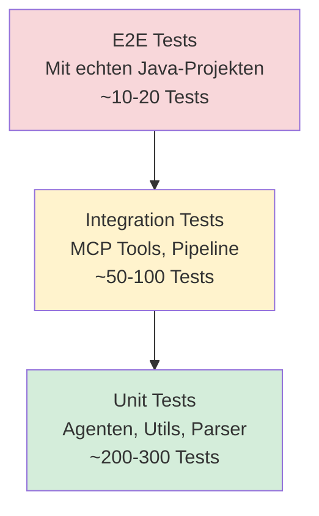

# Testing-Strategie

**Comprehensive Testing Guide für Java Analysis MCP Server**

---

## Übersicht

### Test-Pyramide



### Test-Verzeichnis-Struktur

```
tests/
├── unit/                           # Unit-Tests (~200-300)
│   ├── agents/
│   │   ├── projectMetadata.test.ts
│   │   ├── symbols.test.ts
│   │   ├── search.test.ts
│   │   ├── analysis.test.ts
│   │   ├── snippets.test.ts
│   │   ├── vcs.test.ts
│   │   ├── semantic.test.ts
│   │   ├── watcher.test.ts
│   │   └── cache.test.ts
│   ├── index/
│   │   ├── fulltext.test.ts
│   │   ├── symbols-indexer.test.ts
│   │   ├── tree-sitter-parser.test.ts
│   │   └── incremental-updater.test.ts
│   ├── analysis/
│   │   ├── gradle-runner.test.ts
│   │   ├── compiler-parser.test.ts
│   │   ├── test-parser.test.ts
│   │   └── tools/
│   │       ├── spotbugs.test.ts
│   │       └── checkstyle.test.ts
│   ├── storage/
│   │   ├── cache.test.ts
│   │   ├── symbol-db.test.ts
│   │   └── metadata-store.test.ts
│   ├── utils/
│   │   ├── token-estimator.test.ts
│   │   ├── file-utils.test.ts
│   │   ├── hash.test.ts
│   │   └── dag.test.ts
│   └── mcp/
│       ├── server.test.ts
│       └── tools.test.ts
│
├── integration/                    # Integration-Tests (~50-100)
│   ├── mcp-tools.test.ts
│   ├── pipeline.test.ts
│   ├── indexing.test.ts
│   └── analysis-flow.test.ts
│
├── e2e/                            # End-to-End-Tests (~10-20)
│   ├── simple-java.test.ts
│   ├── multi-module.test.ts
│   ├── with-bugs.test.ts
│   └── test-projects/              # Test-Java-Projekte
│       ├── simple-java/
│       ├── multi-module/
│       └── with-bugs/
│
└── fixtures/                       # Test-Daten
    ├── sample-reports/
    │   ├── spotbugs.xml
    │   ├── checkstyle.xml
    │   └── junit.xml
    ├── sample-gradle-outputs/
    │   ├── compile-error.txt
    │   └── test-failure.txt
    └── gradle-projects/
        └── simple/
            ├── settings.gradle
            └── build.gradle
```

---

## 1. Unit-Tests

**Ziel**: Isolierte Tests für einzelne Klassen/Methoden

### 1.1 Discovery Agent

```typescript
// tests/unit/agents/discovery.test.ts

import { describe, it, expect, beforeEach } from 'vitest';
import { DiscoveryAgent } from '../../../src/agents/discovery';
import path from 'path';

describe('DiscoveryAgent', () => {
  let agent: DiscoveryAgent;

  beforeEach(() => {
    agent = new DiscoveryAgent();
  });

  describe('detectGradleProject', () => {
    it('should detect single-module Gradle project', async () => {
      const projectRoot = path.join(__dirname, '../../fixtures/gradle-projects/simple');
      const isGradle = await agent.detectGradleProject(projectRoot);
      expect(isGradle).toBe(true);
    });

    it('should return false for non-Gradle directory', async () => {
      const projectRoot = '/tmp/not-a-project';
      const isGradle = await agent.detectGradleProject(projectRoot);
      expect(isGradle).toBe(false);
    });
  });

  describe('analyze', () => {
    it('should extract project metadata from simple Gradle project', async () => {
      const projectRoot = path.join(__dirname, '../../fixtures/gradle-projects/simple');
      const metadata = await agent.analyze(projectRoot);

      expect(metadata.root).toBe(projectRoot);
      expect(metadata.buildSystem).toBe('gradle');
      expect(metadata.gradleWrapperPresent).toBe(true);
      expect(metadata.javaVersion).toMatch(/\d+/);
      expect(metadata.modules).toHaveLength(1);
      expect(metadata.modules[0].type).toBe('root');
    });

    it('should extract multiple modules from multi-module project', async () => {
      const projectRoot = path.join(__dirname, '../../fixtures/gradle-projects/multi-module');
      const metadata = await agent.analyze(projectRoot);

      expect(metadata.modules.length).toBeGreaterThan(1);
      expect(metadata.modules.some(m => m.type === 'subproject')).toBe(true);
    });
  });

  describe('parseGradleBuild', () => {
    it('should extract Java version from build.gradle', async () => {
      const buildGradle = `
        plugins {
          id 'java'
        }
        java {
          toolchain {
            languageVersion = JavaLanguageVersion.of(21)
          }
        }
      `;
      const javaVersion = await agent.parseJavaVersion(buildGradle);
      expect(javaVersion).toBe('21');
    });

    it('should extract dependencies', async () => {
      const buildGradle = `
        dependencies {
          implementation 'org.springframework.boot:spring-boot-starter-web:3.2.0'
          testImplementation 'junit:junit:4.13.2'
        }
      `;
      const deps = await agent.parseDependencies(buildGradle);
      expect(deps).toHaveLength(2);
      expect(deps[0].group).toBe('org.springframework.boot');
      expect(deps[0].artifact).toBe('spring-boot-starter-web');
      expect(deps[0].version).toBe('3.2.0');
    });
  });
});
```

---

### 1.2 Tree-Sitter Parser

```typescript
// tests/unit/index/tree-sitter-parser.test.ts

import { describe, it, expect } from 'vitest';
import { JavaParser } from '../../../src/index/tree-sitter-parser';

describe('JavaParser', () => {
  let parser: JavaParser;

  beforeEach(() => {
    parser = new JavaParser();
  });

  describe('extractSymbols', () => {
    it('should extract class definition', () => {
      const code = `
        package com.example;

        public class MyClass {
          private int value;

          public void myMethod() {
            System.out.println("Hello");
          }
        }
      `;

      const symbols = parser.extractSymbols(code, 'MyClass.java');

      const classSymbol = symbols.find(s => s.kind === 'class');
      expect(classSymbol).toBeDefined();
      expect(classSymbol!.name).toBe('MyClass');
      expect(classSymbol!.qualifiedName).toBe('com.example.MyClass');
      expect(classSymbol!.modifiers).toContain('public');
      expect(classSymbol!.location.startLine).toBeGreaterThan(0);

      const fieldSymbol = symbols.find(s => s.kind === 'field');
      expect(fieldSymbol).toBeDefined();
      expect(fieldSymbol!.name).toBe('value');

      const methodSymbol = symbols.find(s => s.kind === 'method');
      expect(methodSymbol).toBeDefined();
      expect(methodSymbol!.name).toBe('myMethod');
      expect(methodSymbol!.parent).toBe('com.example.MyClass');
    });

    it('should extract Java 21 record', () => {
      const code = `
        package com.example;

        public record Person(String name, int age) {
          public String description() {
            return name + " is " + age + " years old";
          }
        }
      `;

      const symbols = parser.extractSymbols(code, 'Person.java');
      const recordSymbol = symbols.find(s => s.kind === 'record');
      expect(recordSymbol).toBeDefined();
      expect(recordSymbol!.name).toBe('Person');
    });

    it('should extract sealed class', () => {
      const code = `
        package com.example;

        public sealed class Shape permits Circle, Rectangle {
        }

        final class Circle extends Shape {
        }
      `;

      const symbols = parser.extractSymbols(code, 'Shape.java');
      const sealedClass = symbols.find(s => s.name === 'Shape');
      expect(sealedClass).toBeDefined();
      expect(sealedClass!.modifiers).toContain('sealed');
    });
  });

  describe('extractReferences', () => {
    it('should extract method calls', () => {
      const code = `
        package com.example;

        public class Service {
          private Repository repo;

          public void save() {
            repo.insert();
          }
        }
      `;

      const references = parser.extractReferences(code, 'Service.java');
      const callRef = references.find(r => r.kind === 'call');
      expect(callRef).toBeDefined();
      expect(callRef!.to).toContain('insert');
    });
  });
});
```

---

### 1.3 Token Estimator

```typescript
// tests/unit/utils/token-estimator.test.ts

import { describe, it, expect } from 'vitest';
import { estimateTokens, truncateToTokenLimit } from '../../../src/utils/token-estimator';

describe('Token Estimator', () => {
  describe('estimateTokens', () => {
    it('should estimate tokens for simple text', () => {
      const text = 'Hello World';
      const tokens = estimateTokens(text);
      expect(tokens).toBeGreaterThan(1);
      expect(tokens).toBeLessThan(10);
    });

    it('should estimate ~15 tokens per line of Java code', () => {
      const line = 'public class Foo { void bar() {} }';
      const tokens = estimateTokens(line);
      expect(tokens).toBeGreaterThan(8);
      expect(tokens).toBeLessThan(25);
    });

    it('should estimate ~1200 tokens for 80-line snippet', () => {
      const lines = Array(80).fill('x'.repeat(60));
      const text = lines.join('\n');
      const tokens = estimateTokens(text);
      expect(tokens).toBeGreaterThan(1000);
      expect(tokens).toBeLessThan(1500);
    });
  });

  describe('truncateToTokenLimit', () => {
    it('should truncate lines to fit token limit', () => {
      const lines = Array(100).fill('x'.repeat(60));
      const truncated = truncateToTokenLimit(lines, 500);

      expect(truncated.length).toBeLessThan(100);
      expect(estimateTokens(truncated.join('\n'))).toBeLessThanOrEqual(500);
    });

    it('should not truncate if already within limit', () => {
      const lines = ['short', 'lines'];
      const truncated = truncateToTokenLimit(lines, 1000);
      expect(truncated).toEqual(lines);
    });
  });
});
```

---

## 2. Integration-Tests

**Ziel**: Tests für MCP-Tools, Pipeline, Agent-Interaktionen

### 2.1 MCP Tools

```typescript
// tests/integration/mcp-tools.test.ts

import { describe, it, expect, beforeAll, afterAll } from 'vitest';
import { MCPServer } from '../../src/mcp/server';
import path from 'path';

describe('MCP Tools Integration', () => {
  let server: MCPServer;
  const testProjectRoot = path.join(__dirname, '../e2e/test-projects/simple-java');

  beforeAll(async () => {
    server = new MCPServer();
    await server.initialize(testProjectRoot);
  });

  afterAll(async () => {
    await server.shutdown();
  });

  describe('project.meta', () => {
    it('should return project metadata', async () => {
      const result = await server.callTool('project.meta', {});

      expect(result.root).toBe(testProjectRoot);
      expect(result.buildSystem).toBe('gradle');
      expect(result.modules).toBeDefined();
      expect(result.modules.length).toBeGreaterThan(0);
    });
  });

  describe('search.find', () => {
    it('should find pattern in Java files', async () => {
      const result = await server.callTool('search.find', {
        pattern: 'public class',
        mode: 'text',
        include: ['src/**/*.java']
      });

      expect(Array.isArray(result)).toBe(true);
      expect(result.length).toBeGreaterThan(0);
      expect(result[0]).toHaveProperty('path');
      expect(result[0]).toHaveProperty('line');
      expect(result[0]).toHaveProperty('lineText');
    });

    it('should respect maxResults limit', async () => {
      const result = await server.callTool('search.find', {
        pattern: 'public',
        maxResults: 10
      });

      expect(result.length).toBeLessThanOrEqual(10);
    });

    it('should include context lines', async () => {
      const result = await server.callTool('search.find', {
        pattern: 'public class',
        contextLines: 2
      });

      expect(result[0].linesBefore).toBeDefined();
      expect(result[0].linesAfter).toBeDefined();
      expect(result[0].linesBefore.length).toBeLessThanOrEqual(2);
    });
  });

  describe('symbols.lookup', () => {
    it('should find symbol definition', async () => {
      const result = await server.callTool('symbols.lookup', {
        qualifiedName: 'com.example.MyClass',
        operation: 'definition'
      });

      expect(result).toHaveProperty('id');
      expect(result).toHaveProperty('kind');
      expect(result.kind).toBe('class');
      expect(result.name).toBe('MyClass');
    });

    it('should find symbol references', async () => {
      const result = await server.callTool('symbols.lookup', {
        qualifiedName: 'com.example.MyClass#myMethod',
        operation: 'references'
      });

      expect(Array.isArray(result)).toBe(true);
      if (result.length > 0) {
        expect(result[0]).toHaveProperty('from');
        expect(result[0]).toHaveProperty('to');
        expect(result[0]).toHaveProperty('kind');
      }
    });
  });

  describe('file.readRange', () => {
    it('should read specific line range', async () => {
      const result = await server.callTool('file.readRange', {
        path: 'src/main/java/com/example/MyClass.java',
        startLine: 1,
        endLine: 10
      });

      expect(result.lines).toBeDefined();
      expect(result.lines.length).toBe(10);
      expect(result.truncated).toBe(false);
    });

    it('should reject oversized snippet', async () => {
      await expect(
        server.callTool('file.readRange', {
          path: 'src/main/java/com/example/LargeClass.java',
          startLine: 1,
          endLine: 200
        })
      ).rejects.toThrow(/Snippet too large/);
    });
  });

  describe('analysis.getReports', () => {
    it('should return compile report', async () => {
      const result = await server.callTool('analysis.getReports', {
        types: ['compile']
      });

      expect(Array.isArray(result)).toBe(true);
      expect(result[0]).toHaveProperty('source');
      expect(result[0].source).toBe('compile');
      expect(result[0]).toHaveProperty('findings');
      expect(result[0]).toHaveProperty('summary');
    });
  });

  describe('vcs.diff', () => {
    it('should return worktree diff', async () => {
      const result = await server.callTool('vcs.diff', {
        scope: 'worktree'
      });

      expect(typeof result).toBe('string');
      // Kann leer sein wenn keine Änderungen
    });
  });

  describe('index.refresh', () => {
    it('should rebuild index', async () => {
      const result = await server.callTool('index.refresh', {
        scope: 'all'
      });

      expect(result).toHaveProperty('filesIndexed');
      expect(result).toHaveProperty('symbolsIndexed');
      expect(result).toHaveProperty('durationMs');
    });
  });
});
```

---

### 2.2 Pipeline Integration

```typescript
// tests/integration/pipeline.test.ts

import { describe, it, expect, beforeAll } from 'vitest';
import { OrchestratorAgent } from '../../src/agents/orchestrator';
import path from 'path';

describe('Pipeline Integration', () => {
  let orchestrator: OrchestratorAgent;
  const testProjectRoot = path.join(__dirname, '../e2e/test-projects/multi-module');

  beforeAll(() => {
    orchestrator = new OrchestratorAgent();
  });

  it('should execute complete analysis pipeline', async () => {
    const result = await orchestrator.executeAnalysisPipeline({
      projectRoot: testProjectRoot,
      analysisTypes: ['compile', 'test', 'spotbugs']
    });

    expect(result.success).toBe(true);
    expect(result.projectMeta).toBeDefined();
    expect(result.indexStats).toBeDefined();
    expect(result.reports).toBeDefined();
    expect(result.reports.length).toBe(3);
  });

  it('should run index phases in parallel', async () => {
    const startTime = Date.now();

    const result = await orchestrator.executeAnalysisPipeline({
      projectRoot: testProjectRoot,
      analysisTypes: []
    });

    const duration = Date.now() - startTime;

    // Parallel sollte schneller sein als 2x sequenziell
    expect(duration).toBeLessThan(20000); // <20s für Index
    expect(result.indexStats.fulltext).toBeDefined();
    expect(result.indexStats.symbols).toBeDefined();
  });

  it('should cache and reuse index', async () => {
    // First run
    await orchestrator.executeAnalysisPipeline({
      projectRoot: testProjectRoot,
      analysisTypes: []
    });

    // Second run (should be faster, cached)
    const startTime = Date.now();
    await orchestrator.executeAnalysisPipeline({
      projectRoot: testProjectRoot,
      analysisTypes: []
    });
    const duration = Date.now() - startTime;

    expect(duration).toBeLessThan(2000); // <2s mit Cache
  });
});
```

---

## 3. End-to-End-Tests

**Ziel**: Tests mit echten Java-Projekten

### 3.1 Test-Projekte

#### Simple-Java
```
tests/e2e/test-projects/simple-java/
├── build.gradle
├── settings.gradle
└── src/
    └── main/java/com/example/
        ├── Main.java
        ├── Service.java
        ├── Repository.java
        ├── Model.java
        └── Utils.java
```

**build.gradle**:
```groovy
plugins {
    id 'java'
    id 'com.github.spotbugs' version '6.0.0'
}

java {
    toolchain {
        languageVersion = JavaLanguageVersion.of(21)
    }
}

repositories {
    mavenCentral()
}

dependencies {
    testImplementation 'org.junit.jupiter:junit-jupiter:5.10.0'
}

test {
    useJUnitPlatform()
}
```

---

#### Multi-Module
```
tests/e2e/test-projects/multi-module/
├── settings.gradle
├── build.gradle
├── core/
│   ├── build.gradle
│   └── src/main/java/...
├── api/
│   ├── build.gradle
│   └── src/main/java/...
└── web/
    ├── build.gradle
    └── src/main/java/...
```

---

#### With-Bugs
Enthält absichtliche Bugs für Testing:
- Compile-Fehler (missing semicolon, undefined variable)
- SpotBugs-Findings (null dereference, resource leak)
- Test-Failures

---

### 3.2 E2E-Test-Suite

```typescript
// tests/e2e/simple-java.test.ts

import { describe, it, expect, beforeAll, afterAll } from 'vitest';
import { MCPServer } from '../../src/mcp/server';
import path from 'path';

describe('E2E: Simple Java Project', () => {
  let server: MCPServer;
  const projectRoot = path.join(__dirname, 'test-projects/simple-java');

  beforeAll(async () => {
    server = new MCPServer();
    await server.initialize(projectRoot);
  }, 30000); // 30s timeout für Index-Build

  afterAll(async () => {
    await server.shutdown();
  });

  it('should discover project metadata', async () => {
    const meta = await server.callTool('project.meta', {});

    expect(meta.javaVersion).toBe('21');
    expect(meta.modules.length).toBe(1);
    expect(meta.gradleWrapperPresent).toBe(true);
  });

  it('should index all Java files', async () => {
    const stats = await server.callTool('index.refresh', { scope: 'all' });

    expect(stats.filesIndexed).toBe(5); // Main, Service, Repository, Model, Utils
    expect(stats.symbolsIndexed).toBeGreaterThan(10);
  });

  it('should find class definitions', async () => {
    const results = await server.callTool('search.find', {
      pattern: 'public class',
      mode: 'text'
    });

    expect(results.length).toBe(5);
  });

  it('should lookup symbol definition', async () => {
    const symbol = await server.callTool('symbols.lookup', {
      qualifiedName: 'com.example.Service',
      operation: 'definition'
    });

    expect(symbol.kind).toBe('class');
    expect(symbol.name).toBe('Service');
  });

  it('should read code snippet', async () => {
    const snippet = await server.callTool('file.readRange', {
      path: 'src/main/java/com/example/Main.java',
      startLine: 1,
      endLine: 20
    });

    expect(snippet.lines.length).toBe(20);
    expect(snippet.language).toBe('java');
  });

  it('should run compile check', async () => {
    const reports = await server.callTool('analysis.getReports', {
      types: ['compile']
    });

    expect(reports[0].source).toBe('compile');
    expect(reports[0].findings.length).toBe(0); // Keine Compile-Fehler
  });
});
```

---

```typescript
// tests/e2e/with-bugs.test.ts

describe('E2E: Project with Bugs', () => {
  // ...

  it('should detect compile errors', async () => {
    const reports = await server.callTool('analysis.getReports', {
      types: ['compile']
    });

    expect(reports[0].findings.length).toBeGreaterThan(0);
    expect(reports[0].summary.bySeverity.error).toBeGreaterThan(0);
  });

  it('should detect SpotBugs findings', async () => {
    const reports = await server.callTool('analysis.getReports', {
      types: ['spotbugs']
    });

    const findings = reports[0].findings;
    expect(findings.length).toBeGreaterThan(0);

    const nullPointerBug = findings.find(f => f.ruleId?.includes('NULL'));
    expect(nullPointerBug).toBeDefined();
  });
});
```

---

## 4. Performance-Tests

```typescript
// tests/performance/indexing.perf.test.ts

import { describe, it, expect } from 'vitest';
import { IndexAgent } from '../../src/agents/index';

describe('Performance: Indexing', () => {
  it('should index 1000+ files in <30s', async () => {
    const agent = new IndexAgent();
    const largeProject = '/path/to/large/project';

    const startTime = Date.now();
    const stats = await agent.buildIndex('all');
    const duration = Date.now() - startTime;

    expect(stats.filesIndexed).toBeGreaterThan(1000);
    expect(duration).toBeLessThan(30000);
  });

  it('should incremental update single file in <2s', async () => {
    const agent = new IndexAgent();
    const file = 'src/main/java/com/example/MyClass.java';

    const startTime = Date.now();
    await agent.updateIncrementally([file]);
    const duration = Date.now() - startTime;

    expect(duration).toBeLessThan(2000);
  });
});
```

---

## 5. Test-Ausführung

### Vitest-Konfiguration

```typescript
// vitest.config.ts

import { defineConfig } from 'vitest/config';

export default defineConfig({
  test: {
    globals: true,
    environment: 'node',
    coverage: {
      provider: 'v8',
      reporter: ['text', 'json', 'html'],
      exclude: ['node_modules/', 'dist/', 'tests/']
    },
    testTimeout: 30000, // 30s für E2E-Tests
    hookTimeout: 30000
  }
});
```

### Scripts

```bash
# Alle Tests
npm run test

# Nur Unit-Tests (schnell)
npm run test:unit

# Nur Integration-Tests
npm run test:integration

# Nur E2E-Tests
npm run test:e2e

# Mit Coverage
npm run test -- --coverage

# Watch-Mode
npm run test -- --watch

# Single Test-File
npm run test tests/unit/agents/discovery.test.ts
```

---

## 6. CI/CD Integration

### GitHub Actions

```yaml
# .github/workflows/test.yml

name: Tests

on: [push, pull_request]

jobs:
  test:
    runs-on: ubuntu-latest

    steps:
      - uses: actions/checkout@v4

      - name: Setup Node.js
        uses: actions/setup-node@v4
        with:
          node-version: '20'

      - name: Setup Java
        uses: actions/setup-java@v4
        with:
          distribution: 'temurin'
          java-version: '21'

      - name: Install dependencies
        run: npm ci

      - name: Run Unit Tests
        run: npm run test:unit

      - name: Run Integration Tests
        run: npm run test:integration

      - name: Run E2E Tests
        run: npm run test:e2e

      - name: Upload Coverage
        uses: codecov/codecov-action@v3
        with:
          files: ./coverage/coverage-final.json
```

---

## 7. Test-Best-Practices

### Do's
- ✅ Nutze Fixtures für Test-Daten (nicht echte User-Projekte)
- ✅ Isoliere Tests (keine gegenseitigen Dependencies)
- ✅ Nutze `beforeEach` für Setup, `afterEach` für Cleanup
- ✅ Teste Edge-Cases (leere Dateien, große Files, Fehler-Fälle)
- ✅ Nutze Snapshots für komplexe Outputs (z.B. AST-Strukturen)

### Don'ts
- ❌ Keine Tests die von externer Netzwerk-Verfügbarkeit abhängen
- ❌ Keine Tests die echte User-Daten modifizieren
- ❌ Keine Tests mit Hardcoded-Pfaden (nutze `path.join(__dirname, ...)`)
- ❌ Keine flakey Tests (Race-Conditions, Timing-abhängig)

---

## Zusammenfassung

### Test-Coverage-Ziele

| Komponente | Target Coverage | Priorität |
|------------|----------------|-----------|
| **Agents** | >90% | Hoch |
| **Index** | >85% | Hoch |
| **Analysis** | >80% | Mittel |
| **Storage** | >85% | Mittel |
| **Utils** | >95% | Hoch |
| **MCP** | >90% | Hoch |

### Test-Checkliste

- [ ] Unit-Tests für alle Agents
- [ ] Unit-Tests für Parser & Indexer
- [ ] Unit-Tests für Utils
- [ ] Integration-Tests für alle MCP-Tools
- [ ] Integration-Tests für Pipeline
- [ ] E2E-Tests mit 3 Test-Projekten
- [ ] Performance-Tests (Indexing, Suche)
- [ ] Token-Budget-Tests
- [ ] Error-Handling-Tests
- [ ] CI/CD-Pipeline

**Ziel**: >85% Test-Coverage, alle E2E-Tests grün! ✅
