# 📖 API Reference - CodeWeaver MCP

**Version:** v0.3.0
**Total Tools:** 19 MCP tools
**Protocol:** Model Context Protocol (MCP) v1.0

Complete reference for all CodeWeaver MCP tools when used as an MCP server with Claude or other AI assistants.

---

## 📋 Table of Contents

1. [Overview](#overview)
2. [Project Tools](#project-tools) (1)
3. [File Operations](#file-operations) (3)
4. [Symbol Tools](#symbol-tools) (4)
5. [Search Tools](#search-tools) (3)
6. [Analysis Tools](#analysis-tools) (2)
7. [Version Control Tools](#version-control-tools) (6)
8. [Response Formats](#response-formats)
9. [Error Handling](#error-handling)
10. [Best Practices](#best-practices)

---

## Overview

### What is MCP?

Model Context Protocol (MCP) is Anthropic's standard for connecting AI assistants to external data sources and tools. CodeWeaver implements MCP to provide Claude (and other AI assistants) with intelligent code analysis capabilities.

### Tool Categories

```mermaid
graph TD
    MCP[CodeWeaver MCP Server] --> A[Project Tools]
    MCP --> B[File Operations]
    MCP --> C[Symbol Tools]
    MCP --> D[Search Tools]
    MCP --> E[Analysis Tools]
    MCP --> F[Version Control]

    A --> A1[project.meta]
    B --> B1[file.read]
    B --> B2[file.readRange]
    B --> B3[file.readWithNumbers]
    C --> C1[symbols.index]
    C --> C2[symbols.find]
    C --> C3[symbols.findByKind]
    C --> C4[symbols.get]
    D --> D1[search.keyword]
    D --> D2[search.semantic]
    D --> D3[search.files]
    E --> E1[analysis.file]
    E --> E2[analysis.project]
    F --> F1[vcs.status]
    F --> F2[vcs.diff]
    F --> F3[vcs.blame]
    F --> F4[vcs.log]
    F --> F5[vcs.branches]
    F --> F6[vcs.compare]

    style MCP fill:#4a90e2
```



---

## Project Tools

### 1. `project.meta`

Get project metadata including Java version, Gradle modules, and dependencies.

**Input Schema:**
```json
{
  "type": "object",
  "properties": {}
}
```

**Example Request:**
```typescript
const result = await client.callTool('project.meta', {});
```

**Example Response:**
```json
{
  "projectType": "gradle-multi-module",
  "javaVersion": "21",
  "gradleVersion": "8.4",
  "modules": [
    {
      "name": "core",
      "path": "./core",
      "dependencies": ["commons-lang3:3.12.0"]
    },
    {
      "name": "api",
      "path": "./api",
      "dependencies": ["spring-boot:3.1.0", "core"]
    }
  ],
  "plugins": ["java", "spring-boot", "checkstyle"]
}
```

**Use Cases:**
- ✅ Understand project structure and dependencies
- ✅ Check Java/Gradle versions
- ✅ Identify multi-module setup

**Performance:** <100ms

---

## File Operations

### 2. `file.read`

Read entire file content with optional token limit (for AI context management).

**Input Schema:**
```json
{
  "type": "object",
  "properties": {
    "filePath": {
      "type": "string",
      "description": "Relative path from project root"
    },
    "maxTokens": {
      "type": "number",
      "description": "Max tokens (default: 10000)"
    }
  },
  "required": ["filePath"]
}
```

**Example Request:**
```typescript
const result = await client.callTool('file.read', {
  filePath: 'src/services/UserService.java',
  maxTokens: 5000
});
```

**Example Response:**
```json
{
  "filePath": "src/services/UserService.java",
  "content": "package com.example.services;\n\npublic class UserService {\n  ...",
  "lines": 234,
  "tokens": 4532,
  "truncated": false
}
```

**Use Cases:**
- ✅ Read files for AI analysis
- ✅ Token-efficient file access (respects Claude's context limits)
- ✅ Preview large files without overwhelming context

**Performance:** <10ms

---

### 3. `file.readRange`

Read specific line range from file (1-indexed, inclusive).

**Input Schema:**
```json
{
  "type": "object",
  "properties": {
    "filePath": { "type": "string" },
    "startLine": { "type": "number", "description": "1-indexed" },
    "endLine": { "type": "number", "description": "Inclusive" }
  },
  "required": ["filePath", "startLine", "endLine"]
}
```

**Example Request:**
```typescript
const result = await client.callTool('file.readRange', {
  filePath: 'src/Main.java',
  startLine: 50,
  endLine: 75
});
```

**Example Response:**
```json
{
  "filePath": "src/Main.java",
  "content": "  public void processPayment(Payment payment) {\n    validate(payment);\n    ...",
  "startLine": 50,
  "endLine": 75,
  "totalLines": 26
}
```

**Use Cases:**
- ✅ Read specific methods/functions
- ✅ Examine error-prone code sections
- ✅ Review specific git blame ranges

**Performance:** <10ms

---

### 4. `file.readWithNumbers`

Read file with line numbers (for easy reference and navigation).

**Input Schema:**
```json
{
  "type": "object",
  "properties": {
    "filePath": { "type": "string" }
  },
  "required": ["filePath"]
}
```

**Example Request:**
```typescript
const result = await client.callTool('file.readWithNumbers', {
  filePath: 'src/Config.java'
});
```

**Example Response:**
```json
{
  "filePath": "src/Config.java",
  "content": "1: package com.example;\n2: \n3: public class Config {\n4:   private String apiKey;\n..."
}
```

**Use Cases:**
- ✅ Reference specific lines in discussions
- ✅ Navigate code more easily
- ✅ Identify problematic line numbers

**Performance:** <10ms

---

## Symbol Tools

### 5. `symbols.index`

Index entire project and extract symbols (classes, methods, fields, etc.) from all supported languages.

**Input Schema:**
```json
{
  "type": "object",
  "properties": {}
}
```

**Example Request:**
```typescript
const result = await client.callTool('symbols.index', {});
```

**Example Response:**
```json
{
  "indexed": {
    "files": 1234,
    "symbols": 8567,
    "byKind": {
      "class": 456,
      "interface": 89,
      "method": 3456,
      "field": 2345,
      "function": 1234,
      "constructor": 456
    },
    "byLanguage": {
      "java": 5000,
      "typescript": 2500,
      "javascript": 800,
      "python": 200,
      "markdown": 67
    }
  },
  "duration": "8.3 seconds",
  "cachePath": ".codeweaver/symbols.jsonl"
}
```

**Use Cases:**
- ✅ **Initial project exploration** - Index before searching
- ✅ **Refresh after major changes** - Re-index when structure changes
- ✅ **Symbol-based navigation** - Enable fast symbol lookup

**Performance:** ~15 seconds for 10k files

**Important:** Run this once when starting a new project analysis. Results are cached.

---

### 6. `symbols.find`

Find symbols by name (case-insensitive substring match).

**Input Schema:**
```json
{
  "type": "object",
  "properties": {
    "name": {
      "type": "string",
      "description": "Symbol name (substring match)"
    }
  },
  "required": ["name"]
}
```

**Example Request:**
```typescript
const result = await client.callTool('symbols.find', {
  name: 'UserService'
});
```

**Example Response:**
```json
{
  "results": [
    {
      "name": "UserService",
      "qualifiedName": "com.example.services.UserService",
      "kind": "class",
      "language": "java",
      "filePath": "src/services/UserService.java",
      "line": 15,
      "signature": "public class UserService",
      "annotations": ["@Service", "@Transactional"]
    },
    {
      "name": "createUser",
      "qualifiedName": "com.example.services.UserService#createUser",
      "kind": "method",
      "language": "java",
      "filePath": "src/services/UserService.java",
      "line": 45,
      "signature": "public User createUser(String username, String email)",
      "parameters": ["String username", "String email"],
      "returnType": "User"
    }
  ],
  "totalResults": 12
}
```

**Use Cases:**
- ✅ Find classes/interfaces/functions by name
- ✅ Discover similar symbols (substring matching)
- ✅ Navigate to symbol definitions

**Performance:** <100ms for 10k files

---

### 7. `symbols.findByKind`

Find symbols by kind (class, method, field, constructor, interface, enum, function).

**Input Schema:**
```json
{
  "type": "object",
  "properties": {
    "kind": {
      "type": "string",
      "enum": ["class", "method", "field", "constructor", "interface", "enum", "function"]
    }
  },
  "required": ["kind"]
}
```

**Example Request:**
```typescript
const result = await client.callTool('symbols.findByKind', {
  kind: 'class'
});
```

**Example Response:**
```json
{
  "kind": "class",
  "results": [
    {
      "name": "UserService",
      "qualifiedName": "com.example.services.UserService",
      "filePath": "src/services/UserService.java",
      "line": 15,
      "language": "java"
    },
    {
      "name": "PaymentService",
      "qualifiedName": "com.example.services.PaymentService",
      "filePath": "src/services/PaymentService.java",
      "line": 20,
      "language": "java"
    }
  ],
  "totalResults": 456
}
```

**Use Cases:**
- ✅ List all classes in project
- ✅ Find all methods/functions
- ✅ Enumerate interfaces or enums
- ✅ Architectural overview

**Performance:** <100ms

---

### 8. `symbols.get`

Get detailed information about a specific symbol by qualified name.

**Input Schema:**
```json
{
  "type": "object",
  "properties": {
    "qualifiedName": {
      "type": "string",
      "description": "Fully qualified name (e.g., com.example.MyClass#myMethod)"
    }
  },
  "required": ["qualifiedName"]
}
```

**Example Request:**
```typescript
const result = await client.callTool('symbols.get', {
  qualifiedName: 'com.example.services.UserService#createUser'
});
```

**Example Response:**
```json
{
  "symbol": {
    "name": "createUser",
    "qualifiedName": "com.example.services.UserService#createUser",
    "kind": "method",
    "language": "java",
    "filePath": "src/services/UserService.java",
    "line": 45,
    "signature": "public User createUser(String username, String email)",
    "parameters": [
      {"name": "username", "type": "String"},
      {"name": "email", "type": "String"}
    ],
    "returnType": "User",
    "annotations": ["@Override", "@Transactional"],
    "visibility": "public",
    "modifiers": ["public"],
    "documentation": "Creates a new user with the given username and email."
  }
}
```

**Use Cases:**
- ✅ Get detailed symbol information
- ✅ Understand method signatures
- ✅ Check annotations/decorators
- ✅ Type information lookup

**Performance:** <10ms

---

## Search Tools

### 9. `search.keyword`

Search for keyword in files (grep-like, with regex support).

**Input Schema:**
```json
{
  "type": "object",
  "properties": {
    "keyword": { "type": "string" },
    "caseSensitive": { "type": "boolean", "default": true },
    "maxResults": { "type": "number", "default": 100 },
    "contextLines": { "type": "number", "default": 0 },
    "fileExtensions": { "type": "array", "items": { "type": "string" } }
  },
  "required": ["keyword"]
}
```

**Example Request:**
```typescript
const result = await client.callTool('search.keyword', {
  keyword: 'sendEmail',
  caseSensitive: true,
  maxResults: 50,
  contextLines: 2
});
```

**Example Response:**
```json
{
  "keyword": "sendEmail",
  "results": [
    {
      "filePath": "src/services/NotificationService.java",
      "line": 67,
      "content": "  public void sendEmail(String to, String subject) {",
      "context": {
        "before": ["  // Send email notification", "  @Async"],
        "after": ["    emailClient.send(to, subject);", "  }"]
      }
    }
  ],
  "totalResults": 12,
  "truncated": false
}
```

**Use Cases:**
- ✅ Find all usages of a method/function
- ✅ Search for specific patterns (regex)
- ✅ Refactoring support (find all references)
- ✅ Code review (find TODO, FIXME, etc.)

**Performance:** <200ms for 10k files

---

### 10. `search.semantic`

AI-powered semantic search by meaning/intent (uses vector embeddings).

**Input Schema:**
```json
{
  "type": "object",
  "properties": {
    "query": {
      "type": "string",
      "description": "Natural language query"
    },
    "limit": { "type": "number", "default": 10 },
    "collection": {
      "type": "string",
      "enum": ["code", "docs", "all"],
      "default": "all"
    }
  },
  "required": ["query"]
}
```

**Example Request:**
```typescript
const result = await client.callTool('search.semantic', {
  query: 'How does user authentication work?',
  limit: 5,
  collection: 'all'
});
```

**Example Response:**
```json
{
  "query": "How does user authentication work?",
  "results": [
    {
      "filePath": "src/auth/AuthService.java",
      "content": "public class AuthService {\n  public User authenticate(String username, String password) {\n    ...",
      "score": 0.92,
      "collection": "code"
    },
    {
      "filePath": "docs/AUTHENTICATION.md",
      "content": "## Authentication Flow\n\nUser authentication is handled by the AuthService...",
      "score": 0.88,
      "collection": "docs"
    }
  ],
  "totalResults": 5
}
```

**Use Cases:**
- ✅ **Conceptual search** - "Find error handling logic"
- ✅ **Intent-based** - "Where is payment processing implemented?"
- ✅ **Documentation search** - "How to configure database?"
- ✅ **Cross-language search** - Finds similar concepts regardless of naming

**Performance:** <1.2s for 10k files (after initial indexing)

**Note:** Requires initial semantic indexing (~10 minutes for 10k files). See [SEMANTIC_SEARCH.md](./../guides/SEMANTIC_SEARCH.md).

---

### 11. `search.files`

Find files by name pattern (glob-like: `*.java`, `*Test.ts`).

**Input Schema:**
```json
{
  "type": "object",
  "properties": {
    "pattern": {
      "type": "string",
      "description": "File pattern (* and ? wildcards)"
    }
  },
  "required": ["pattern"]
}
```

**Example Request:**
```typescript
const result = await client.callTool('search.files', {
  pattern: '*Service.java'
});
```

**Example Response:**
```json
{
  "pattern": "*Service.java",
  "results": [
    "src/services/UserService.java",
    "src/services/PaymentService.java",
    "src/services/NotificationService.java"
  ],
  "totalResults": 23
}
```

**Use Cases:**
- ✅ Find all test files (`*Test.java`, `*.spec.ts`)
- ✅ Locate configuration files (`*.config.js`)
- ✅ Find all service classes (`*Service.java`)

**Performance:** <50ms

---

## Analysis Tools

### 12. `analysis.file`

Analyze a single file for complexity metrics and code quality.

**Input Schema:**
```json
{
  "type": "object",
  "properties": {
    "filePath": { "type": "string" }
  },
  "required": ["filePath"]
}
```

**Example Request:**
```typescript
const result = await client.callTool('analysis.file', {
  filePath: 'src/services/PaymentService.java'
});
```

**Example Response:**
```json
{
  "filePath": "src/services/PaymentService.java",
  "metrics": {
    "linesOfCode": 234,
    "cyclomaticComplexity": 28,
    "averageComplexity": 3.5,
    "methods": 8,
    "classes": 1
  },
  "methodComplexity": [
    {"name": "processPayment", "complexity": 8, "line": 45},
    {"name": "validateCard", "complexity": 5, "line": 120},
    {"name": "sendReceipt", "complexity": 2, "line": 180}
  ],
  "quality": {
    "rating": "B",
    "issues": [
      "Method 'processPayment' has high complexity (8). Consider refactoring."
    ]
  }
}
```

**Use Cases:**
- ✅ Identify complex methods needing refactoring
- ✅ Code quality assessment
- ✅ Technical debt tracking
- ✅ Code review assistance

**Performance:** <100ms

---

### 13. `analysis.project`

Analyze entire project for overall code quality and metrics.

**Input Schema:**
```json
{
  "type": "object",
  "properties": {}
}
```

**Example Request:**
```typescript
const result = await client.callTool('analysis.project', {});
```

**Example Response:**
```json
{
  "summary": {
    "totalFiles": 1234,
    "totalLines": 125000,
    "totalMethods": 5678,
    "averageComplexity": 2.8,
    "maxComplexity": 15
  },
  "topComplexMethods": [
    {"file": "src/services/PaymentService.java", "method": "processPayment", "complexity": 15},
    {"file": "src/api/UserController.java", "method": "handleRequest", "complexity": 12}
  ],
  "qualityMetrics": {
    "overallRating": "B+",
    "filesWithHighComplexity": 23,
    "filesWithVeryHighComplexity": 3
  },
  "recommendations": [
    "Refactor PaymentService.processPayment (complexity: 15)",
    "Consider splitting UserController (>500 LOC)"
  ]
}
```

**Use Cases:**
- ✅ Project health overview
- ✅ Identify refactoring priorities
- ✅ Track technical debt
- ✅ Onboarding (understand codebase quality)

**Performance:** ~20 seconds for 10k files

---

## Version Control Tools

### 14. `vcs.status`

Get Git repository status (modified, staged, untracked files).

**Input Schema:**
```json
{
  "type": "object",
  "properties": {}
}
```

**Example Response:**
```json
{
  "branch": "feature/user-auth",
  "modified": ["src/services/UserService.java"],
  "staged": ["src/api/AuthController.java"],
  "untracked": ["docs/AUTH.md"],
  "ahead": 2,
  "behind": 0
}
```

**Performance:** <100ms

---

### 15. `vcs.diff`

Get Git diff (changes between commits/branches).

**Input Schema:**
```json
{
  "type": "object",
  "properties": {
    "ref1": { "type": "string", "default": "HEAD" },
    "ref2": { "type": "string", "optional": true }
  }
}
```

**Example Request:**
```typescript
const result = await client.callTool('vcs.diff', {
  ref1: 'HEAD~1',
  ref2: 'HEAD'
});
```

**Example Response:**
```json
{
  "diff": "diff --git a/src/UserService.java b/src/UserService.java\n+  public void createUser() {\n...",
  "files": ["src/UserService.java", "src/User.java"],
  "additions": 45,
  "deletions": 12
}
```

**Performance:** <200ms

---

### 16. `vcs.blame`

Get Git blame (line-by-line authorship and commit info).

**Input Schema:**
```json
{
  "type": "object",
  "properties": {
    "filePath": { "type": "string" },
    "startLine": { "type": "number", "optional": true },
    "endLine": { "type": "number", "optional": true }
  },
  "required": ["filePath"]
}
```

**Example Response:**
```json
{
  "filePath": "src/UserService.java",
  "blame": [
    {"line": 45, "commit": "abc123", "author": "John Doe", "date": "2025-11-01", "content": "  public void createUser() {"},
    {"line": 46, "commit": "abc123", "author": "John Doe", "date": "2025-11-01", "content": "    validate(user);"}
  ]
}
```

**Performance:** <200ms

---

### 17. `vcs.log`

Get Git commit history.

**Input Schema:**
```json
{
  "type": "object",
  "properties": {
    "maxCount": { "type": "number", "default": 10 }
  }
}
```

**Example Response:**
```json
{
  "commits": [
    {
      "hash": "abc123",
      "author": "John Doe",
      "date": "2025-11-17",
      "message": "feat: add user authentication",
      "filesChanged": 5
    }
  ],
  "totalCommits": 10
}
```

**Performance:** <150ms

---

### 18. `vcs.branches`

List all Git branches.

**Input Schema:**
```json
{
  "type": "object",
  "properties": {}
}
```

**Example Response:**
```json
{
  "current": "feature/user-auth",
  "branches": ["main", "develop", "feature/user-auth", "feature/payment"]
}
```

**Performance:** <100ms

---

### 19. `vcs.compare`

Compare two Git branches or commits.

**Input Schema:**
```json
{
  "type": "object",
  "properties": {
    "base": { "type": "string" },
    "compare": { "type": "string" }
  },
  "required": ["base", "compare"]
}
```

**Example Response:**
```json
{
  "base": "main",
  "compare": "feature/user-auth",
  "filesChanged": 12,
  "additions": 345,
  "deletions": 89,
  "commits": 5
}
```

**Performance:** <300ms

---

## Response Formats

### Success Response
```json
{
  "content": [
    {
      "type": "text",
      "text": "{ ... JSON data ... }"
    }
  ]
}
```

### Error Response
```json
{
  "isError": true,
  "content": [
    {
      "type": "text",
      "text": "Error: File not found: src/missing.java"
    }
  ]
}
```

---

## Error Handling

### Common Errors

| Error | Cause | Solution |
|-------|-------|----------|
| `File not found` | Invalid file path | Check file path is relative to project root |
| `Not a git repository` | No .git directory | Initialize git or run from git repo |
| `Symbol index not found` | Symbols not indexed | Run `symbols.index` first |
| `Semantic index not found` | Semantic search not initialized | Run semantic indexing (see SEMANTIC_SEARCH.md) |
| `Timeout` | Large project, slow operation | Increase timeout or use smaller scope |

---

## Best Practices

### 1. Always Index First
```typescript
// ✅ Good workflow
await client.callTool('symbols.index', {});
await client.callTool('symbols.find', { name: 'UserService' });

// ❌ Bad - will fail
await client.callTool('symbols.find', { name: 'UserService' });
```

### 2. Use Token Limits for Large Files
```typescript
// ✅ Good - respects Claude's context limits
await client.callTool('file.read', {
  filePath: 'LargeFile.java',
  maxTokens: 10000
});

// ⚠️ May exceed context
await client.callTool('file.read', {
  filePath: 'LargeFile.java'
  // No token limit - might be huge
});
```

### 3. Combine Tools for Powerful Workflows
```typescript
// Find + Analyze + Blame workflow
const symbols = await client.callTool('symbols.find', { name: 'Payment' });
const analysis = await client.callTool('analysis.file', { filePath: symbols.results[0].filePath });
const blame = await client.callTool('vcs.blame', { filePath: symbols.results[0].filePath });
```

### 4. Use Semantic Search for Concepts
```typescript
// ✅ Good use of semantic search
await client.callTool('search.semantic', {
  query: 'error handling and retry logic'
});

// ❌ Better with keyword search
await client.callTool('search.keyword', {
  keyword: 'UserService'  // Exact name known
});
```

---

## Performance Tips

1. **Index Once** - Symbol indexing is cached, don't re-index unless needed
2. **Use File Patterns** - `search.files` is faster than `search.keyword` for filenames
3. **Limit Results** - Use `maxResults` to avoid overwhelming responses
4. **Token Limits** - Always use `maxTokens` when reading files for AI
5. **Semantic Search** - Pre-index with file watcher for fast updates

---

## Related Documentation

- **[QUICKSTART.md](./../getting-started/QUICKSTART.md)** - Get started in 5 minutes
- **[USAGE.md](./USAGE.md)** - CLI usage (same tools, different interface)
- **[SEMANTIC_SEARCH.md](./../guides/SEMANTIC_SEARCH.md)** - Semantic search guide
- **[PERFORMANCE.md](./PERFORMANCE.md)** - Performance benchmarks

---

**Version:** v0.3.0
**Last Updated:** 2025-11-17
**Protocol:** MCP v1.0
**Total Tools:** 19

**Questions?** [Open an issue](https://github.com/nobiehl/codeweaver-mcp/issues)
