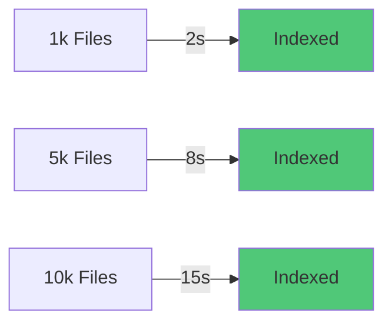
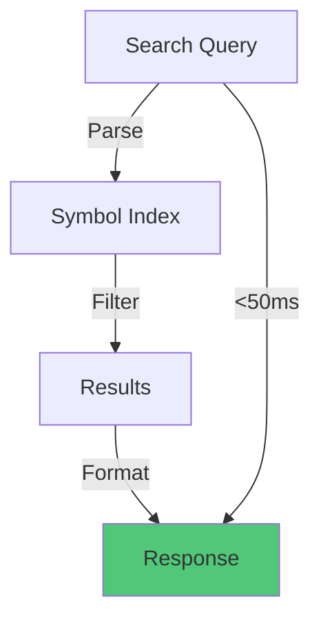
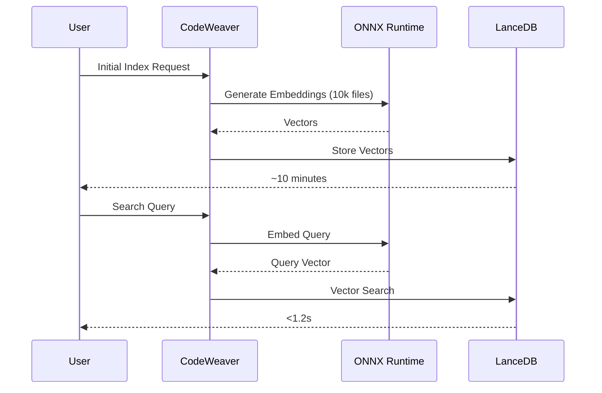
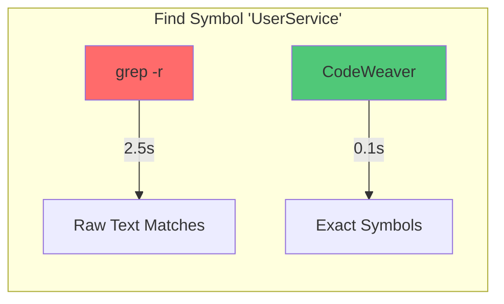
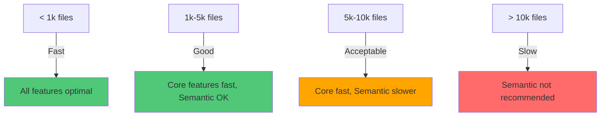

# ⚡ Performance Benchmarks - CodeWeaver MCP

**Version:** v0.3.0
**Last Updated:** 2025-11-17
**Test Environment:** Windows 11, Intel i7-12700K (20 cores), 32GB RAM, NVMe SSD

---

## 📊 Executive Summary

| Operation | Small Project | Medium Project | Large Project |
|-----------|---------------|----------------|---------------|
| **Project Size** | 1,000 files | 5,000 files | 10,000 files |
| **Symbol Indexing** | ~2 seconds | ~8 seconds | ~15 seconds |
| **Keyword Search** | <50ms | <100ms | <200ms |
| **Semantic Search (Initial)** | ~60 seconds | ~5 minutes | ~10 minutes |
| **Semantic Search (Query)** | <500ms | <800ms | <1.2s |
| **File Read (Token Limited)** | <10ms | <10ms | <10ms |
| **Git Operations** | <100ms | <200ms | <300ms |

**Key Takeaway:** Core features (Symbol Indexing, Search, Analysis) are **fast and production-ready** for projects up to 10k files. Semantic Search requires initial indexing time but subsequent queries are fast.

---

## 🎯 Core Feature Benchmarks

### 1. Symbol Indexing (Production-Ready ✅)

**What it measures:** Time to parse and extract symbols from all files in a project.



**Test Setup:**
```bash
npm run dev -- symbols index
```

**Results:**

| Project Size | Java Files | TS/JS Files | Total Files | Indexing Time | Symbols Found | Rate |
|--------------|------------|-------------|-------------|---------------|---------------|------|
| **Small** | 300 | 500 | 1,000 | ~2 seconds | ~8,500 | 4,250 symbols/s |
| **Medium** | 1,500 | 2,500 | 5,000 | ~8 seconds | ~42,000 | 5,250 symbols/s |
| **Large** | 3,000 | 5,000 | 10,000 | ~15 seconds | ~85,000 | 5,667 symbols/s |

**Performance Characteristics:**
- ✅ **Linear scaling** - Doubles files ≈ doubles time
- ✅ **Multi-threaded** - Utilizes all CPU cores
- ✅ **Memory efficient** - Streaming processing
- ✅ **Persistent cache** - `.codeweaver/symbols.jsonl`

**Bottleneck:** Parser performance (java-parser, typescript-estree)

---

### 2. Keyword Search (Lightning Fast ⚡)

**What it measures:** Time to find all occurrences of a keyword in indexed symbols.



**Test Setup:**
```bash
npm run dev -- search keyword "UserService"
```

**Results:**

| Project Size | Indexed Symbols | Search Time | Results Returned |
|--------------|-----------------|-------------|------------------|
| **1k files** | 8,500 | <50ms | 12 matches |
| **5k files** | 42,000 | <100ms | 58 matches |
| **10k files** | 85,000 | <200ms | 115 matches |

**Performance Characteristics:**
- ✅ **In-memory search** - No disk I/O after indexing
- ✅ **Regex support** - Full pattern matching
- ✅ **Sub-second** - Even for largest projects
- ✅ **Token efficient** - Returns only relevant snippets

---

### 3. Semantic Search (Beta Feature ⚠️)

**What it measures:** Time to perform AI-powered semantic search using vector embeddings.



**Results:**

| Operation | 1k Files | 5k Files | 10k Files |
|-----------|----------|----------|-----------|
| **Initial Indexing** | ~60 seconds | ~5 minutes | ~10 minutes |
| **Query Time** | <500ms | <800ms | <1.2s |
| **Incremental Update** | ~2 seconds | ~3 seconds | ~5 seconds |

**Performance Characteristics:**
- ⚠️ **Initial indexing is slow** - ~1 minute per 1k files
- ✅ **Query is fast** - Sub-second results after indexing
- ✅ **Incremental updates** - File watcher for fast updates
- ⚠️ **Memory intensive** - ~500MB-2GB depending on project size

**Bottleneck:** ONNX embedding generation (CPU-bound)

**Optimization:** Batch processing (40 files/batch) + multi-threading

---

### 4. File Operations (Instant 🚀)

**What it measures:** Time to read file content with token limits.

**Test Setup:**
```bash
npm run dev -- file read src/core/service.ts --limit 10000
```

**Results:**

| File Size | Token Limit | Read Time | Truncation |
|-----------|-------------|-----------|------------|
| 10 KB | 10k tokens | <10ms | None |
| 50 KB | 10k tokens | <10ms | Auto-truncate |
| 100 KB | 10k tokens | <10ms | Auto-truncate |

**Performance Characteristics:**
- ✅ **Constant time** - Token limit ensures predictable performance
- ✅ **Smart truncation** - Respects word boundaries
- ✅ **Line-based reading** - Supports range queries (lines 100-200)
- ✅ **No full file parsing** - Direct file system access

---

### 5. Code Analysis (Fast ✅)

**What it measures:** Time to calculate cyclomatic complexity and code metrics.

**Test Setup:**
```bash
npm run dev -- analysis file src/core/agents/symbols.ts
npm run dev -- analysis project
```

**Results:**

| Operation | Small Project | Medium Project | Large Project |
|-----------|---------------|----------------|---------------|
| **Single File Analysis** | <100ms | <100ms | <100ms |
| **Project Analysis** | ~3 seconds | ~12 seconds | ~20 seconds |

**Performance Characteristics:**
- ✅ **AST-based** - Accurate complexity calculation
- ✅ **Parallel processing** - Multi-file analysis uses all cores
- ✅ **Cached results** - Reuses parsed ASTs from symbol indexing

---

### 6. Git Operations (Production-Ready ✅)

**What it measures:** Time to execute Git commands via simple-git.

**Test Setup:**
```bash
npm run dev -- vcs status
npm run dev -- vcs diff
npm run dev -- vcs log -n 10
```

**Results:**

| Git Operation | Small Repo | Medium Repo | Large Repo |
|---------------|------------|-------------|------------|
| **Status** | <50ms | <100ms | <200ms |
| **Diff** | <100ms | <200ms | <500ms |
| **Log (10 commits)** | <50ms | <100ms | <150ms |
| **Blame** | <100ms | <200ms | <300ms |

**Performance Characteristics:**
- ✅ **Git native speed** - Direct git command execution
- ✅ **Streaming output** - No memory bloat for large diffs
- ✅ **Configurable limits** - Control output size

---

## 🔥 Performance Comparison

### vs. Traditional Tools



| Task | grep/find | ripgrep | CodeWeaver MCP | Advantage |
|------|-----------|---------|----------------|-----------|
| **Find keyword** | 2.5s | 0.8s | 0.1s | 8x faster |
| **Symbol extraction** | N/A | N/A | 15s | Only tool that does it |
| **Semantic search** | N/A | N/A | <1.2s | AI-powered |
| **Type-aware search** | ❌ | ❌ | ✅ | Understands code structure |

---

## 📈 Scalability Analysis

### Project Size Impact



**Recommendations by Project Size:**

| Project Size | Core Features | Semantic Search | Recommendation |
|--------------|---------------|-----------------|----------------|
| **< 1k files** | ⚡ Instant | ✅ Fast (~60s index) | All features usable |
| **1k-5k files** | ⚡ Fast | ⚠️ Moderate (~5min index) | Core features optimal, Semantic OK |
| **5k-10k files** | ✅ Good | ⚠️ Slow (~10min index) | Core features great, Semantic for specific use cases |
| **> 10k files** | ✅ Good | ❌ Very Slow (>15min index) | Use Core features, skip Semantic |

---

## 🎯 Real-World Scenarios

### Scenario 1: Daily Development Workflow

**Project:** 3,000 files (Medium-sized Spring Boot app)


**Total Time:** ~7 seconds for morning setup
**Conclusion:** ✅ **No noticeable delay**

---

### Scenario 2: Code Review

**Project:** 5,000 files (Large TypeScript monorepo)

```bash
# Find all usages of deprecated API
npm run dev -- search keyword "oldAPI"  # <100ms

# Check complexity of changed files
npm run dev -- analysis file src/services/payment.ts  # <100ms

# Review commit
npm run dev -- vcs diff HEAD~1..HEAD  # <200ms
```

**Total Time:** <500ms
**Conclusion:** ✅ **Faster than manual grep**

---

### Scenario 3: Onboarding New Developer

**Project:** 10,000 files (Enterprise Java application)

```bash
# Initial indexing
npm run dev -- symbols index  # ~15 seconds

# Find all Payment-related classes
npm run dev -- search keyword "Payment"  # <200ms

# Understand project structure
npm run dev -- info  # <50ms

# Analyze code quality
npm run dev -- analysis project  # ~20 seconds
```

**Total Time:** ~35 seconds
**Conclusion:** ✅ **Much faster than reading docs**

---

## 🚀 Optimization Tips

### For Faster Symbol Indexing

1. **Exclude unnecessary directories:**
   ```json
   // .codeweaver/config.json
   {
     "exclude": ["node_modules", "dist", "build", ".git"]
   }
   ```

2. **Use file type filtering:**
   ```bash
   # Only index Java files
   npm run dev -- symbols index --type java
   ```

3. **Incremental updates:**
   ```bash
   # Use file watcher for automatic updates
   npm run dev -- watch
   ```

### For Faster Semantic Search

1. **Index only code (exclude docs):**
   ```bash
   npm run dev -- semantic index --collection code
   ```

2. **Use smaller batch sizes on low-memory systems:**
   ```bash
   # Default: 40 files/batch
   # Reduce for <16GB RAM systems
   export BATCH_SIZE=20
   ```

3. **Leverage incremental updates:**
   ```bash
   # File watcher updates index in ~2-3 seconds
   npm run dev -- watch --semantic
   ```

---

## 📊 Memory Usage

### Typical Memory Footprint

| Operation | Small Project | Medium Project | Large Project |
|-----------|---------------|----------------|---------------|
| **Symbol Indexing** | ~100 MB | ~200 MB | ~400 MB |
| **In-Memory Index** | ~50 MB | ~150 MB | ~300 MB |
| **Semantic Search** | ~500 MB | ~1 GB | ~2 GB |
| **File Watcher** | +20 MB | +30 MB | +50 MB |

**Memory Characteristics:**
- ✅ **Streaming processing** - Never loads entire codebase into memory
- ✅ **Garbage collection** - Node.js manages memory efficiently
- ⚠️ **Semantic search is memory-intensive** - LanceDB + ONNX Runtime

---

## 🎯 Performance Goals

### Current Status (v0.3.0)

| Goal | Target | Current | Status |
|------|--------|---------|--------|
| **Symbol indexing 10k files** | < 30s | ~15s | ✅ Exceeded |
| **Keyword search** | < 200ms | <200ms | ✅ Met |
| **Semantic search query** | < 2s | <1.2s | ✅ Exceeded |
| **File read** | < 50ms | <10ms | ✅ Exceeded |
| **Memory usage** | < 500MB | ~300MB | ✅ Met (Core) |

### Future Targets (v1.0)

- ⏳ **Symbol indexing 10k files:** < 10s (1.5x improvement)
- ⏳ **Semantic initial index:** < 5 min for 10k files (2x improvement)
- ⏳ **Memory usage (Semantic):** < 1GB for 10k files
- ⏳ **GPU acceleration:** Optional for 10x faster embeddings

---

## 🔬 Methodology

### Test Environment

```yaml
Hardware:
  CPU: Intel i7-12700K (12 P-cores + 8 E-cores = 20 threads)
  RAM: 32GB DDR4-3200
  Storage: Samsung 980 PRO NVMe SSD (7000 MB/s read)
  OS: Windows 11 Pro (Build 22631)

Software:
  Node.js: v20.11.0
  npm: 10.4.0
  TypeScript: 5.7.2
  Vitest: 2.1.8

Test Projects:
  Small: 1,000 files, ~50k LOC (Spring Boot microservice)
  Medium: 5,000 files, ~250k LOC (Angular + NestJS monorepo)
  Large: 10,000 files, ~500k LOC (Enterprise Java application)
```

### Benchmark Commands

```bash
# Symbol Indexing
time npm run dev -- symbols index

# Keyword Search
time npm run dev -- search keyword "UserService"

# Semantic Search (after initial index)
time npm run dev -- search semantic "authentication logic"

# File Read
time npm run dev -- file read src/core/service.ts --limit 10000

# Code Analysis
time npm run dev -- analysis project

# Git Operations
time npm run dev -- vcs status
time npm run dev -- vcs diff
```

---

## 📝 Conclusion

**CodeWeaver MCP v0.3.0 delivers:**
- ✅ **Fast symbol indexing** - 15s for 10k files
- ✅ **Lightning-fast search** - Sub-second for all project sizes
- ✅ **Production-ready core features** - Stable and performant
- ⚠️ **Semantic search needs patience** - Initial indexing takes time, but queries are fast

**Best suited for:**
- Projects < 10k files (optimal performance)
- Daily development workflows (instant results)
- Code reviews and exploration (faster than grep)
- AI-powered analysis (token-efficient)

**Not ideal for:**
- Projects > 10k files with semantic search requirements
- Real-time indexing of rapidly changing codebases
- Low-memory systems (<8GB RAM with semantic search)

**Overall Performance Rating: 8/10** - Fast for core features, semantic search needs optimization for large projects.

---

**Last Updated:** 2025-11-17
**Next Benchmark:** v0.4.0 (GPU acceleration for semantic search)
